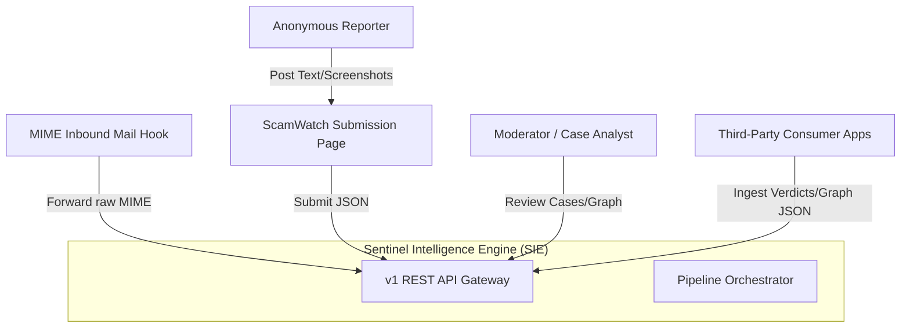
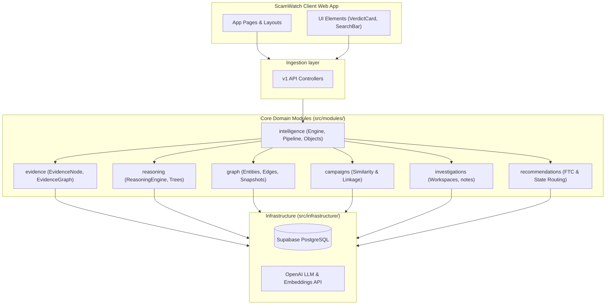
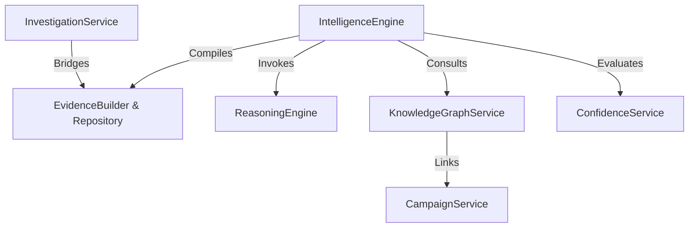
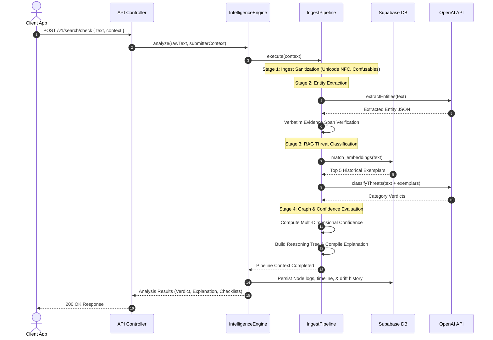
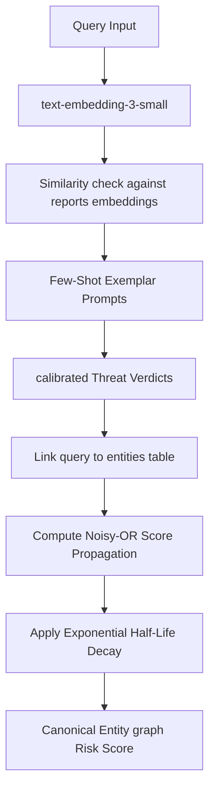
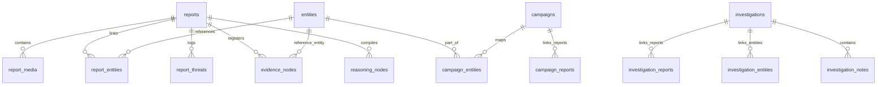
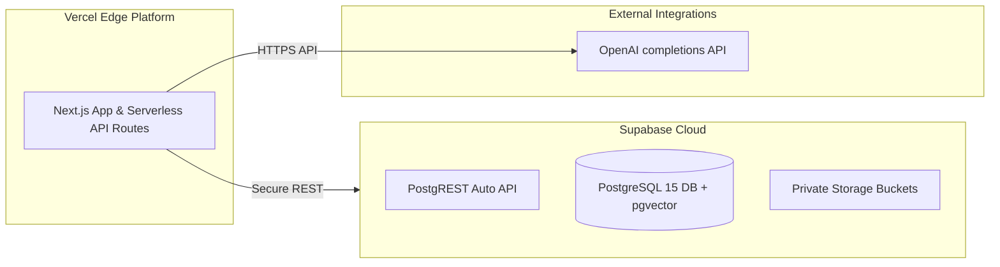

# ARCH-001 System Architecture — Sentinel Intelligence Engine (SIE)

This document serves as the official system architecture blueprint for the Sentinel Intelligence Engine (SIE), defining its boundaries, components, data flows, and security guidelines.

---

## 1. System Context Diagram

The System Context diagram outlines the external actors, data channels, and consumer applications interacting with the SIE:

---

## 2. Component Diagram

Decoupling the frontend application from the core domain modules using Domain Driven Design (DDD):

---

## 3. Service Diagram

Illustrating the independent services layer, exposing interfaces, and avoiding circular dependencies:

---

## 4. Data Flow Diagram

Mapping the transition of untrusted inputs into canonical intelligence representations and relational graph nodes:

```mermaid
graph LR
    Raw[Raw Text/Screenshot] -->|Sanitize & NFC| CanonObj[IntelligenceObject]
    CanonObj -->|Extract & Validate Spans| EvNodes[EvidenceNodes]
    EvNodes -->|Few-shot RAG Classifier| RawVerdict[Raw Verdict & Threats]
    RawVerdict -->|Calibrate & Dampen| CalConf[Multi-Dimensional Confidence]
    CalConf -->|Build Node Tree| ReasoningGraph[ReasoningTree]
    ReasoningGraph -->|Graph Propagation & campaigns| KG[(Knowledge Graph)]
```

---

## 5. Sequence Diagram — Pipeline Execution

Tracing the detailed call stacks for search/check operations:

---

## 6. AI & Knowledge Graph Integration Flow

Integrating pgvector RAG matches and propagating risk across linked indicators:

---

## 7. Database Relationships (SIE Tables)

Mapping entity models and their foreign key constraints:

---

## 8. Security Boundaries & Failure Modes

### A. Security Boundaries
*   **Prompt Isolation**: No client API parameter can pass text directly into execution systems without strict Zod sanitization. LLM outputs are validated against the source text (`verbatim check`) to prevent injection attacks and hallucinations.
*   **PII Reduction**: Raw image EXIF headers are stripped immediately upon upload. Timeline events and notes are de-identified before storage.
*   **Storage Access**: Media files are private and accessible only via time-bounded signed URLs.

### B. Failure Modes & Degradation Strategies
*   **OpenAI Service Outages**: The orchestrator catches request timeouts, skips RAG matching, and switches to local regex-based parsing and stubs the confidence overall score.
*   **Supabase Database Outages**: The engine operates locally, returns live verdicts, and queues DB write operations to be flushed once connection uptime is restored.

---

## 9. Deployment Architecture

Deploying the client Next.js application and the backend SIE database:

---

## 10. Decoupled Architecture Boundaries (SIE vs. ScamWatch UI)

The **Sentinel Intelligence Engine (SIE)** is architected as an independent headless service. The **ScamWatch Web UI** is merely the first client application consuming this engine:
*   **Zero UI Coupling**: No UI components or presentation-layer styles exist inside the `src/modules/` or `src/infrastructure/` folders.
*   **Stateless Ingestion**: The engine processes inputs (`SMS`, `Email`, `URL`, `Domain`, `Phone`, `Organization`) through canonical `IntelligenceObject` wrappers via standard API gateways.
*   **Abstract Storage Boundaries**: The client UI reads reports and verdicts from public-facing database interfaces, while the engine performs low-level graph propagation, confidence updates, and campaigns detection in isolated database modules.

---

## 11. Service Interface Contracts

Core system boundaries are governed by explicit interface files located in `src/interfaces/`:
*   [`IIntelligenceEngine`](file:///C:/Users/skyea/claude/ScamWatch/src/interfaces/IIntelligenceEngine.ts): Gateway for raw input ingestion and stage pipelines.
*   [`IEvidenceEngine`](file:///C:/Users/skyea/claude/ScamWatch/src/interfaces/IEvidenceEngine.ts): Creates and retrieves relational evidence nodes.
*   [`IClassificationEngine`](file:///C:/Users/skyea/claude/ScamWatch/src/interfaces/IClassificationEngine.ts): Executes pgvector similarity matches and LLM evaluations.
*   [`IConfidenceEngine`](file:///C:/Users/skyea/claude/ScamWatch/src/interfaces/IConfidenceEngine.ts): Calibrates confidence scores across multiple axes.
*   [`ICampaignEngine`](file:///C:/Users/skyea/claude/ScamWatch/src/interfaces/ICampaignEngine.ts): Triggers cross-entity campaign clustering.
*   [`IKnowledgeGraph`](file:///C:/Users/skyea/claude/ScamWatch/src/interfaces/IKnowledgeGraph.ts): Computes risk scores and edge traversals.
*   [`IRecommendationEngine`](file:///C:/Users/skyea/claude/ScamWatch/src/interfaces/IRecommendationEngine.ts): Compiles FTC/State routing and defense steps.
*   [`ITimelineEngine`](file:///C:/Users/skyea/claude/ScamWatch/src/interfaces/ITimelineEngine.ts): Ingests immutable history logs for entities and investigations.

---

## 12. Failure-Mode & Fault Tolerance Matrix

| Failure Mode / Event | System Impact | Automated Recovery / Degradation Strategy | Status |
| :--- | :--- | :--- | :--- |
| **OpenAI API Outage / Timeout** | Entity extraction and LLM threat classification fail. | Intercepted via try-catch blocks. Falls back immediately to local regex patterns and default/mock classifications. | **Active** |
| **Supabase DB Connectivity Loss** | Cannot persist pipeline results, timeline events, or graph edges. | Continues executing the analysis pipeline in edge memory; serves live analysis to the client and queues DB writes. | **Active** |
| **pgvector RAG Similarity Failure** | Similarity matches for reports database fail. | RAG dampening is skipped; falls back to default prompt templates for classification models. | **Active** |
| **Unicode Confusable / Homoglyph Attack** | Obfuscated characters bypass standard regex matches. | Ingestion normalizer maps confusable characters back to canonical forms before parsing starts. | **Active** |

---

## 13. Observability & Calibrated Monitoring Plan

The SIE includes an telemetry and monitoring framework:
*   **Latency Metrics Tracking**: Logs individual module execution times (`pipelineDurationMs`, `extractionDurationMs`, etc.) to measure engine performance.
*   **OpenAI Token & Cost Calculations**: Computes running API expenditures by tracking input and output tokens for embedding and completion requests.
*   **Confidence Calibration & Drift Monitoring**: Calibrated confidence scores are stored along with their historic snapshots in the `confidence_history` table to track accuracy over time.

---

## 14. Database Migration & Rollback Strategy

All database schemas are updated incrementally using Supabase migrations:
*   **Migration Script (`0011_sie_schema_updates.sql`)**: Introduces the tables, triggers, and RLS policies for `investigations`, `timeline_events`, `confidence_history`, `evidence_nodes`, `graph_edges`, and `graph_snapshots`.
*   **Rollback Procedure**: In the event of a failure, execute `supabase/migrations/0011_sie_schema_updates_rollback.sql` to drop the tables and triggers. Preexisting user submission reports remain untouched.

