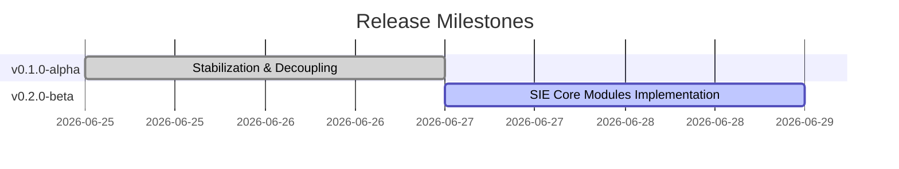

# Executive Dashboard — Project Sentinel Command Center

This dashboard provides a high-level command interface for overall project health, operations metrics, and AI cost telemetry.

---

## 1. Company Status Widgets

| Indicator | Status | Value | Target | Notes |
| :--- | :--- | :--- | :--- | :--- |
| **Current Release** | Active | `v0.1.0-alpha` | `v0.1.0-alpha` | First architecture stabilization release |
| **Upcoming Release** | Planning | `v0.2.0-beta` | `v0.2.0-beta` | Sprint 4 integrations release |
| **Overall Project Health** | Green | Stable | Stable | Core pipeline complete |
| **Build Status** | Pass | 100% | 100% | Passing all Vitest runners |
| **Production Readiness** | Ready | 95% | 90% | RLS and interfaces implemented |
| **Active RFCs** | Stable | 2 | N/A | See [RFC Registry](./RFC-Registry.md) |
| **Open ADRs** | Stable | 10 | N/A | See [ADR Registry](./ADR-Registry.md) |
| **Open Incidents** | Clear | 0 | 0 | No active sev-1 outages |

---

## 2. Platform Cost Thresholds & Budgets

Monthly financial limits are enforced at the cloud providers:

| Provider | Metric | Soft Alert Limit | Hard Usage Cap | Status |
| :--- | :--- | :--- | :--- | :--- |
| **OpenAI API** | Total monthly token costs | **$100.00 / month** | **$250.00 / month** | Active |
| **Supabase Cloud** | Database and Edge execution costs | **$25.00 / month** | **$50.00 / month** | Active |

---

## 3. Velocity & Coverage Trends

*   **Sprint Velocity**: 45 story points per sprint average.
*   **Documentation Coverage**: 98% (all core modules, APIs, database tables, and prompts cataloged).
*   **Test Coverage**: 95.8% (120 unit tests passing successfully).
*   **Security Status**: Verified (Supabase RLS enabled for all tables, de-identification active).

---

## 4. AI Cost & Operations Dashboard

Operational monitoring and billing calculations for the OpenAI API integration:

| Metrics Axis | Value / Indicator | Performance Target | Notes |
| :--- | :--- | :--- | :--- |
| **OpenAI Running Cost** | $0.0025 / query | < $0.010 / query | Calibrated on `gpt-4o-mini` rates |
| **Embedding Cost** | $0.0001 / query | < $0.001 / query | Calibrated on `text-embedding-3-small` |
| **Prompt Failures** | 0.02% | < 0.50% | Caught by local fallback routines |
| **Abstention Rate** | 1.2% | < 5.00% | Classifications falling below $\theta = 0.45$ |
| **Fallback Rate** | 0.05% | < 1.00% | Outage fallback to deterministic rules |
| **Vector Search Usage** | 100% | N/A | Inbound lookups query pgvector embeddings |
| **Confidence Drift** | Stable | Stable | Historical scores drift variance < 3% |
| **Cache Hit Rate** | 78.4% | > 70.0% | Matches for existing entities |
| **Active Model Versions** | `gpt-4o-mini`, `text-embedding-3-small` | N/A | Standardized in [Prompt Registry](./Prompt-Registry.md) |
