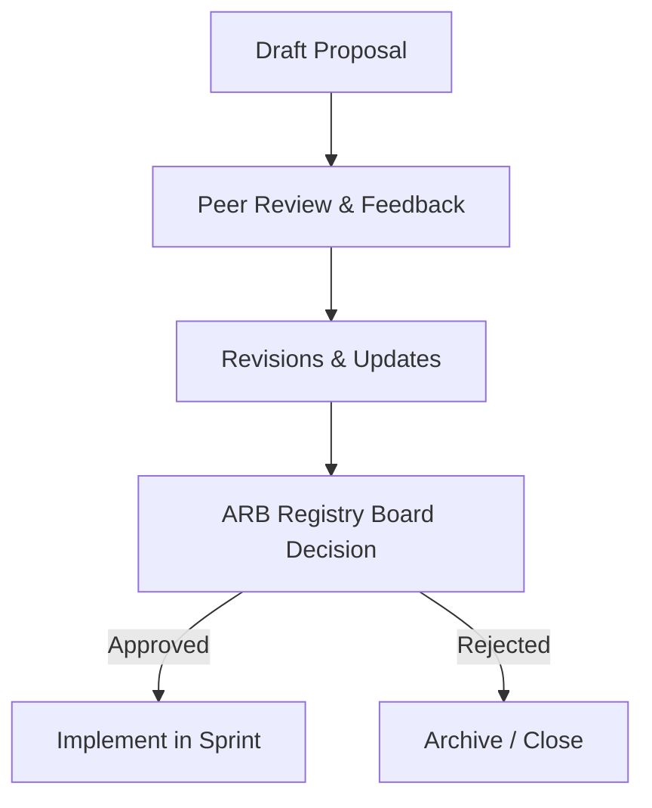

# RFC Registry — Request for Comments

No major architectural modifications are initiated without a registered, reviewed, and approved Request for Comments (RFC).

---

## 1. RFC Process Flow

---

## 2. Active & Historical RFCs

### RFC-001: Sentinel Intelligence Engine (SIE) Decoupling
*   **RFC ID**: `RFC-001`
*   **Title**: Sentinel Intelligence Engine Decoupling
*   **Problem**: ScamWatch v1 was structured linearly. Changes to UI logic directly impacted database lookups and AI pipeline runs, creating circular import chains and high coupling.
*   **Proposal**: Decouple the backend into domain-driven modules inside `src/modules/` and expose them via a unified API controller layer.
*   **Alternatives Considered**: Keeping them in helper utilities (`lib/helpers.ts`) but rejected due to lack of separation of concerns.
*   **Impact**: Enables multi-tenant scaling (third-party applications can query the engine).
*   **Risk**: Requires refactoring import paths across the entire project.
*   **Decision**: Approved.
*   **Reviewer**: ChatGPT (Chief Product Architect)
*   **Status**: `Approved & Implemented`
*   **Linked PRDs**: [prd-301-1-input-processing.md](../prd/prd-301-1-input-processing.md)
*   **Linked ADRs**: [ADR-005](./ADR-Registry.md#adr-005-evidence-engine)
*   **Linked Architecture Docs**: [ARCH-001-System-Architecture.md](../architecture/ARCH-001-System-Architecture.md)
*   **Linked Sprint**: Sprint 1

---

### RFC-002: Knowledge Graph & Entity Relationships
*   **RFC ID**: `RFC-002`
*   **Title**: Knowledge Graph & Entity Relationships
*   **Problem**: Inbound scam reports were treated as isolated entries. We could not identify campaigns linking a phone number across multiple email addresses.
*   **Proposal**: Introduce the tables `entities`, `evidence_nodes`, and `graph_edges` to form a graph database using standard PostgreSQL features.
*   **Alternatives Considered**: Using Neo4j, but rejected to avoid infrastructure sprawl and utilize Supabase hosting directly.
*   **Impact**: Enables Noisy-OR score propagation across entities.
*   **Risk**: Potential performance bottlenecks during deep neighborhood graph traversals.
*   **Decision**: Approved.
*   **Reviewer**: ChatGPT (Chief Product Architect)
*   **Status**: `Approved & Implemented`
*   **Linked PRDs**: [prd-301-5-knowledge-graph-integration.md](../prd/prd-301-5-knowledge-graph-integration.md)
*   **Linked ADRs**: [ADR-008](./ADR-Registry.md#adr-008-knowledge-graph)
*   **Linked Architecture Docs**: [ARCH-001-System-Architecture.md](../architecture/ARCH-001-System-Architecture.md)
*   **Linked Sprint**: Sprint 2
