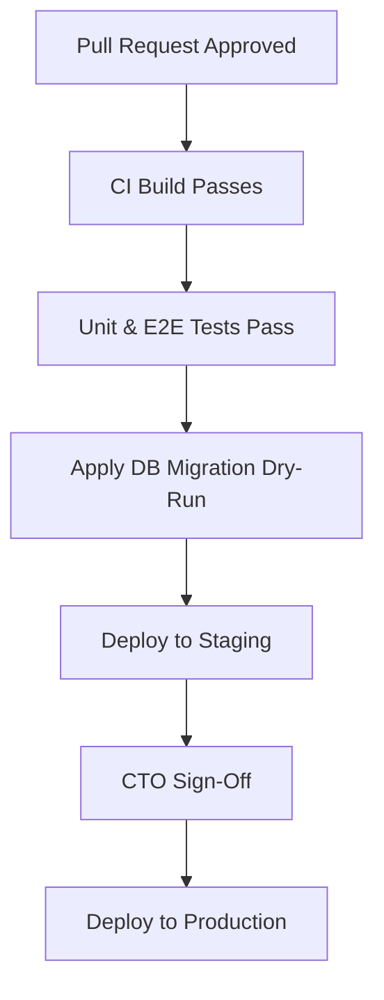

# Release Management — Deployments Registry

Every production deployment must be documented, approved, and have a verified rollback procedure.

---

## 1. Release Checklist & Gates

---

## 2. Release Logs

### Release v0.1.0-alpha (Sprint 2 Core Launch)
*   **Release Version**: `v0.1.0-alpha`
*   **Sprint Reference**: Sprint 2
*   **Features Included**:
    *   Ingestion of canonical `IntelligenceObject` instances.
    *   Noisy-OR risk propagation on Knowledge Graph.
    *   Multi-dimensional confidence evaluation.
*   **Database Migrations**: `0011_sie_schema_updates.sql` applied.
*   **Rollback Procedure**:
    1.  Revert Vercel deployment commit back to previous stable release tag.
    2.  Execute SQL rollback script `0011_sie_schema_updates_rollback.sql` in Supabase SQL editor to drop the new tables and triggers.
*   **Approval Status**: `Approved`
*   **Deployment Date**: 2026-06-28
*   **Deployment Owner**: Antigravity

---

### Release v0.2.0-beta (Sprint 3 Operational Maturity)
*   **Release Version**: `v0.2.0-beta`
*   **Sprint Reference**: Sprint 3
*   **Features Included**:
    *   TypeScript service interface contracts.
    *   Executive and CTO dashboards, and registries cataloging.
*   **Database Migrations**: None.
*   **Rollback Procedure**: Revert codebase commit in Vercel console.
*   **Approval Status**: `Pending Approval`
*   **Deployment Date**: 2026-06-29
*   **Deployment Owner**: Antigravity
