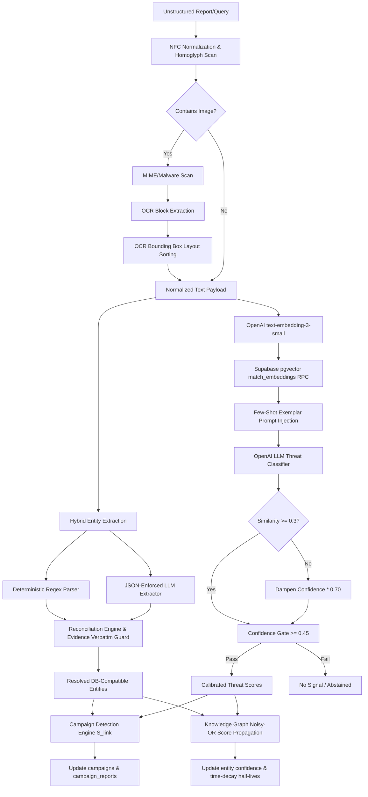

# PRD-301 AI Scam Analyzer Implementation Guide

This guide details the technical implementation, system architecture, folder layouts, database structures, and testing procedures for the **PRD-301 AI Scam Analyzer** pipeline within ScamWatch.

---

## 1. System Architecture Map

The diagram below maps the ingestion, extraction, classification, campaign linking, and graph score propagation flows:



---

## 2. Folder Structure

The implementation components reside in the following project directories:

```
ScamWatch/
├── docs/prd/
│   ├── README.md                              # This implementation guide
│   ├── prd-301-1-input-processing.md          # Input sanitization and OCR specs
│   ├── prd-301-2-entity-extraction.md         # Hybrid extractor specification
│   ├── prd-301-3-threat-classification.md     # RAG few-shot classification specs
│   ├── prd-301-4-confidence-scoring.md        # Isotonic regression & gate limits
│   ├── prd-301-5-knowledge-graph-integration.md # Graph schemas & score propagation specs
│   ├── prd-301-6-campaign-detection.md        # Correlation linking score algorithm specs
│   ├── prd-301-7-recommendation-engine.md     # Verify and Protect checklist specs
│   ├── prd-301-8-explainability-engine.md     # Citation template specs
│   ├── prd-301-9-api-contract.md              # REST payloads & error envelopes specs
│   └── prd-301-10-evaluation-benchmarking.md  # Golden set evaluation constraints
├── src/
│   ├── app/api/v1/
│   │   ├── search/
│   │   │   ├── route.ts                       # GET /api/v1/search endpoint
│   │   │   └── check/
│   │   │       └── route.ts                   # POST /api/v1/search/check endpoint
│   │   └── reports/
│   │       └── route.ts                       # POST /api/v1/reports endpoint
│   ├── components/ui/
│   │   ├── ExplanationPanel.tsx               # Renders citation-mapped summaries
│   │   └── VerdictCard.tsx                    # Renders verdict risk and confidence bands
│   ├── lib/
│   │   ├── ai/
│   │   │   ├── client.ts                      # OpenAI API client instance configuration
│   │   │   └── classify.ts                    # RAG classifier and threat multi-label mapper
│   │   ├── campaigns/
│   │   │   └── detect.ts                      # Campaign linking score and clustering engine
│   │   ├── entities/
│   │   │   ├── canonicalize.ts                # E.164 phone and URL normalization rules
│   │   │   ├── extractEntities.ts             # Deterministic regex entity parser
│   │   │   └── extractEntitiesHybrid.ts       # LLM + rules reconciliation extractor
│   │   ├── graph/
│   │   │   └── propagate.ts                   # Knowledge Graph Noisy-OR scorer
│   │   ├── ingestion/
│   │   │   └── sanitize.ts                    # Unicode normalizer and OCR sorting logic
│   │   └── search/
│   │       ├── explain.ts                     # Grounded citations generator
│   │       ├── lookup.ts                      # Real-time search query lookup handler
│   │       └── recommend.ts                   # Recovery checklists generator
└── tests/unit/
    ├── sanitize.test.ts                       # Verifies Unicode normalization & OCR sorting
    ├── propagate.test.ts                      # Verifies Noisy-OR graph propagation & time-decay
    ├── campaigns.test.ts                      # Verifies campaign linking scores & db mocks
    ├── extractEntitiesHybrid.test.ts          # Verifies hybrid extractor & hallucination guards
    ├── classify.test.ts                       # Verifies RAG classifier & confidence gates
    └── searchRoutes.test.ts                   # Verifies search route inputs & response envelopes
```

---

## 3. How the Pipeline Works

When a new report is submitted or a search check is performed, the analyzer executes in five steps:

1.  **Ingestion Sanitization**: Payloads are NFC normalized. Domains and brand labels are scanned for Cyrillic confusables, replacing homoglyphs with Latin equivalents. Fragments extracted from screenshots are grouped into vertical overlap lines, sorted left-to-right, and assembled top-to-bottom.
2.  **Hybrid Entity Extraction**: The parser runs deterministic regexes (phones, URLs, emails, handles, crypto wallets) alongside a schema-constrained LLM query. Extracted coordinates are checked; if the LLM's evidence span is not present verbatim, it is rejected. Overlapping indicators are merged into a single entity with elevated confidence.
3.  **RAG Threat Classification**: The report text is converted to a vector embedding. Supabase matches this against historical report embeddings. Nearest matches are injected into the prompt as few-shot exemplars. If similarity is low ($< 0.3$), the classifier confidence is dampened by multiplying by `0.7`. If the final confidence falls below `0.45`, it abstains.
4.  **Campaign Detection**: The engine evaluates the new report against active campaigns, computing a composite link score based on entity rarity weights, semantic similarities, and time/location closeness. If $S_{\text{link}} \ge 0.70$, the report joins the campaign.
5.  **Score Propagation**: The Knowledge Graph updates connected node risks. An entity's combined risk is calculated using a Noisy-OR aggregation of all linked report scores, decayed exponentially using half-lives (30 days for domains/URLs, 90 for phones, 180 for wallets).

---

## 4. Environment Variables

Configure the following parameters in `.env.local`:

```bash
# OpenAI Configuration
OPENAI_API_KEY="your-openai-api-key"
OPENAI_MODEL_CLASSIFIER="gpt-4o-mini"       # Model for classification and extraction
OPENAI_MODEL_EXPLAINER="gpt-4o"            # Model for text explanations
OPENAI_EMBEDDING_MODEL="text-embedding-3-small" # Model for pgvector embeddings (1536-dim)

# Supabase Configuration
NEXT_PUBLIC_SUPABASE_URL="https://your-project.supabase.co"
NEXT_PUBLIC_SUPABASE_ANON_KEY="your-anon-key"
SUPABASE_SERVICE_ROLE_KEY="your-service-role-key" # Bypasses RLS for migrations/seed scripts
```

---

## 5. Supabase & Database Requirements

### Stored Procedure (`match_embeddings`)
The pgvector similarity matching runs in PostgreSQL. Apply the migration in [0010_match_embeddings.sql](file:///C:/Users/skyea/claude/ScamWatch/supabase/migrations/0010_match_embeddings.sql) to expose the procedure to the API:

```sql
create or replace function public.match_embeddings(
  query_embedding vector(1536),
  match_threshold float,
  match_count int,
  filter_owner_type text
)
returns table (
  id uuid,
  owner_id uuid,
  similarity float
)
language plpgsql stable security definer as $$
begin
  return query
  select
    embeddings.id,
    embeddings.owner_id,
    (1 - (embeddings.embedding <=> query_embedding))::float as similarity
  from public.embeddings
  where embeddings.owner_type = filter_owner_type
    and (1 - (embeddings.embedding <=> query_embedding)) > match_threshold
  order by embeddings.embedding <=> query_embedding asc
  limit match_count;
end;
$$;
```

---

## 6. How to Run Tests

The test suite runs offline unit and mock database tests.

```bash
# Run all unit tests
npm run test

# Run tests in watch mode (interactive)
npx vitest

# Generate coverage reports
npx vitest run --coverage
```

---

## 7. Current Limitations

1.  **Offline Graceful Degradation**: If OpenAI is down or the api key is omitted, the pipeline falls back to rules-only extraction and zero-shot empty-exemplar classifications. This ensures availability but lowers categorization specificity.
2.  **Sandbox OCR Limits**: Low-legibility screenshots (confidence $< 0.55$) are flagged `low_legibility` and processed, but layout reconstructions may become misaligned on extremely skewed vertical lines.
3.  **Static Rarity Mapping**: Rarity weights use entity type fallbacks (wallets/URLs: `1.0`, phones: `0.5`, domains: `0.05`). Future releases will replace these with real-time dynamic graph degree ratios.
