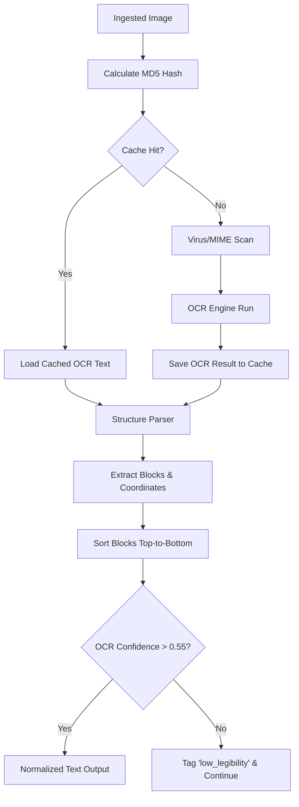

# PRD-301.1 — Input Processing Specification

**Program Codename:** Project Sentinel · **Module:** AI Intelligence Engine (§8.1 & §8.2) · **Status:** Implementation-Ready Spec
**Discipline:** AI/ML, Backend Engineering, Security, QA · **Requirement ID Prefix:** `IP-301.1`

---

## Abstract
This document specifies the engineering design, security boundaries, and data pipelines for the **Input Processing** module of ScamWatch. The module acts as the ingestion gateway for all user-submitted scam reports. It supports raw text copy-pastes, screenshots (with OCR extraction), and raw email payloads. The pipeline performs sanitization, UTF-8 normalization, homoglyph detection, and de-identification before any downstream classification or knowledge graph ingestion occurs.

---

## Table of Contents
1. [Purpose](#1-purpose)
2. [Background](#2-background)
3. [Supported Input Channels & Formats](#3-supported-input-channels--formats)
4. [Ingest Normalization & Sanitization](#4-ingest-normalization--sanitization)
5. [OCR Pipeline & Reading Order](#5-ocr-pipeline--reading-order)
6. [Requirements](#6-requirements)
7. [Acceptance Criteria](#7-acceptance-criteria)
8. [Edge Cases & Error Boundaries](#8-edge-cases--error-boundaries)
9. [Security & Privacy Considerations](#9-security--privacy-considerations)
10. [Accessibility Contract](#10-accessibility-contract)
11. [Performance & Latency Budgets](#11-performance--latency-budgets)
12. [Future Expansion](#12-future-expansion)

---

## 1. Purpose
The Input Processing module is the platform's front line, transforming unstructured, untrusted user uploads into clean, standardized text payloads. It strips attack vectors (e.g. scripts or remote images in emails), extracts legibly written elements from screenshots, and flags formatting anomalies (like Cyrillic confusables) used by scammers to evade matching systems.

---

## 2. Background
Scam reports originate from diverse, messy consumer interfaces: text messages (SMS), chat transcripts (WhatsApp/Facebook), screenshots of phone screens, and forwarded email headers. These inputs can be weaponized or naturally corrupted:
- Phishing emails containing active scripts or tracking pixels that resolve when fetched.
- Cyrillic or other non-Latin homoglyphs embedded in domains (`google.com` vs `goоgle.com` using Cyrillic `о`) to trick text filters.
- Low-legibility screenshots resulting in fragmented OCR outputs.

This spec details a highly secure, sandboxed ingestion layer that cleans these inputs and protects the downstream LLM extraction and Knowledge Graph steps.

---

## 3. Supported Input Channels & Formats

The module ingestion layer processes three primary input streams:

```
[Raw Ingestion]
  ├── Text Channel       ⟶ String normalization (UTF-8, NFC, homoglyph scan)
  ├── Image Channel      ⟶ Supabase Storage scan ⟶ OCR Engine (block extraction)
  └── Email Channel      ⟶ MIME parsing ⟶ HTML sanitization & quarantined scripts
```

### 3.1. Text Channel
- **Format**: Plain text strings up to `50 KB`.
- **Intake**: Copy-paste blocks from SMS, WhatsApp, iMessage, and web forms.

### 3.2. Image Channel
- **Format**: Binary files (`image/png`, `image/jpeg`, `image/webp`) up to `10 MB` per file.
- **Intake**: Screenshots of smishing messages, phishing pages, and email lists.

### 3.3. Email Channel
- **Format**: Raw email source payload (MIME format conforming to RFC 5322).
- **Intake**: Forwarded emails via automated inbound mail hooks.

---

## 4. Ingest Normalization & Sanitization

### 4.1. Text Decoding & Unicode Normalization
All inputs MUST be decoded into UTF-8. The parser MUST apply **Unicode Normalization Form C (NFC)** to resolve decomposed characters. 

### 4.2. Homoglyph & Confusable Scan
- The normalizer MUST scan the input string for character sequences combining multiple scripts (e.g., Latin and Cyrillic character sets in a single host or word).
- If homoglyphs are found, set `flags.contains_confusables = true` and record the canonical Latin equivalents for graph indexing.

### 4.3. Email MIME & HTML Parsing
- **MIME Parsing**: Parse email files to extract `headers` (From, To, Subject, Date, Received, DKIM-Signature), `plain_text_body`, and `html_body`.
- **HTML Sanitization**: Parse `html_body` into an abstract syntax tree (AST). Strip all `<script>`, `<object>`, `<embed>`, and `<iframe>` nodes. 
- **Quarantine**: Extract script content and write to a quarantined, non-executable metadata column for forensic analysis.

---

## 5. OCR Pipeline & Reading Order

The OCR pipeline converts raw images into structured text via an abstract `OcrProvider` wrapper:



### 5.1. Legibility Threshold
- The OCR wrapper MUST extract an overall `ocr_confidence` score from the provider.
- If the confidence score is below `0.55`, the pipeline MUST set `status = "low_legibility"` and proceed, signaling the downstream UI to warn the user about extraction accuracy.

### 5.2. Reading Order Reconstruction
- To handle multi-column layouts and conversational threads, the pipeline MUST sort extracted text blocks dynamically using bounding box coordinates:
  1. Group blocks into horizontal zones based on vertical overlap.
  2. Sort blocks within each zone from left to right (or right to left if `languageHint` indicates a RTL script).
  3. Concatenate text zones chronologically from top to bottom, separating blocks with a newline separator (`\n`).

---

## 6. Requirements

### 6.1. Functional Requirements
- **IP-301.1.1 (MUST)**: Ingested reports MUST NOT require the user to have a registered account; anonymous submissions MUST be treated as first-class objects.
- **IP-301.1.2 (MUST)**: All incoming text payloads MUST undergo NFC Unicode normalization.
- **IP-301.1.3 (MUST)**: The system MUST parse email payloads safely, stripping script tags and disabling active elements.
- **IP-301.1.4 (MUST)**: Image uploads MUST be written to Supabase Storage and scanned for malware and correct MIME types before executing OCR.
- **IP-301.1.5 (MUST NOT)**: Ingested links or remote image sources (e.g. tracking pixels) MUST NOT be loaded or resolved over the network during ingestion.

### 6.2. Non-Functional Requirements
- **IP-301.1.6 (MUST)**: Non-OCR normalization (character cleaning, email header parsing, HTML stripping) MUST complete in under `300ms` p95 for a 50 KB text file.
- **IP-301.1.7 (MUST)**: OCR processing on a single standard screenshot MUST complete in under `4.0s` p95 using the standard cloud tier.
- **IP-301.1.8 (MUST)**: OCR results MUST be cached by the image file's MD5 content hash. Identical image uploads MUST bypass OCR execution entirely.

---

## 7. Acceptance Criteria

- **AC-301.1.a**: Given a screenshot-only report, when normalized, then the pipeline MUST set the `channels` field to `["screenshot"]`, leave the `normalized_text` null, and queue the file for the OCR stage.
- **AC-301.1.b**: Given a text containing Cyrillic homoglyphs inside a Latin word, when normalized, then the system MUST set `flags.contains_confusables = true` and provide a normalized Latin-only string in the metadata.
- **AC-301.1.c**: Given an email forwarding payload containing `<script>alert('scam')</script>`, when parsed, then the script block MUST be quarantined, the tag stripped from the body, and no client-side alert triggered during rendering.
- **AC-301.1.d**: Given an image upload that fails MIME check (e.g., a renamed `.exe` file), when ingested, then the upload MUST be rejected immediately with a file format error.

---

## 8. Edge Cases & Error Boundaries

### 8.1. Conversational Chat Layouts (Conversational Blocks)
- **Edge Case**: A screenshot contains two distinct conversation bubbles (left and right alignment). 
- **Handling**: Bounding boxes MUST be analyzed for horizontal alignment. Bubbles with different alignments MUST be sorted chronologically by their top vertical position and prefixed with an inferred participant identifier (e.g. `[Left Bubble]: ... \n [Right Bubble]: ...`).

### 8.2. OCR Service Outage
- **Edge Case**: The cloud OCR provider returns a 500 error or times out.
- **Handling**: The image ingestion queue MUST NOT crash. The system MUST catch the error, flag `flags.ocr_failed = true`, and store the report status as `ready_for_rules` (relying on raw email headers or metadata if available).

---

## 9. Security & Privacy Considerations
- **SEC-301.1.1**: The ingestion sandbox MUST block Server-Side Request Forgery (SSRF) by disabling DNS resolution and outbound HTTP connections for any URL parsed during normalized ingestion.
- **SEC-301.1.2**: Submitter PII (such as their own phone numbers or email addresses in screenshots) MUST be detected using localized regex filters and tagged `submitter_pii` to allow automatic redacting in user-facing explanation interfaces.
- **SEC-301.1.3**: Direct cloud storage buckets containing raw screenshot uploads MUST NOT be publicly readable. All client access to original screenshots MUST be granted through temporary, authenticated Supabase signed URLs valid for less than 15 minutes.

---

## 10. Accessibility Contract
- **A11Y-301.1.1**: Ingestion forms (file upload dropzones, copy-paste text areas) MUST have descriptive, screen-reader-audible `<label>` bindings and support full keyboard navigation (tab focus, Space/Enter trigger for file uploads).
- **A11Y-301.1.2**: Error indicators (e.g. "File too large") MUST be announced immediately using `aria-live="assertive"`.

---

## 11. Performance & Latency Budgets
- **Text Normalizer**: `p50 < 50ms`, `p95 < 300ms` for 50 KB.
- **MIME Parser**: `p50 < 80ms`, `p95 < 200ms`.
- **Supabase Storage upload**: `p50 < 400ms`, `p95 < 1.2s` (network dependent).
- **OCR processing**: `p50 < 1.8s`, `p95 < 4.0s` (cached: `< 50ms`).

---

## 12. Future Expansion
1. **Audio Transcription**: Add support for `.wav`/`.mp3` voice call recordings, routing them to an audio model (Whisper API) to extract conversational transcripts.
2. **Video Ingest Parsing**: Extract frames from screen-recorded scam interactions, using frame deduplication to feed a temporal sequence of screenshots into the OCR pipeline.
