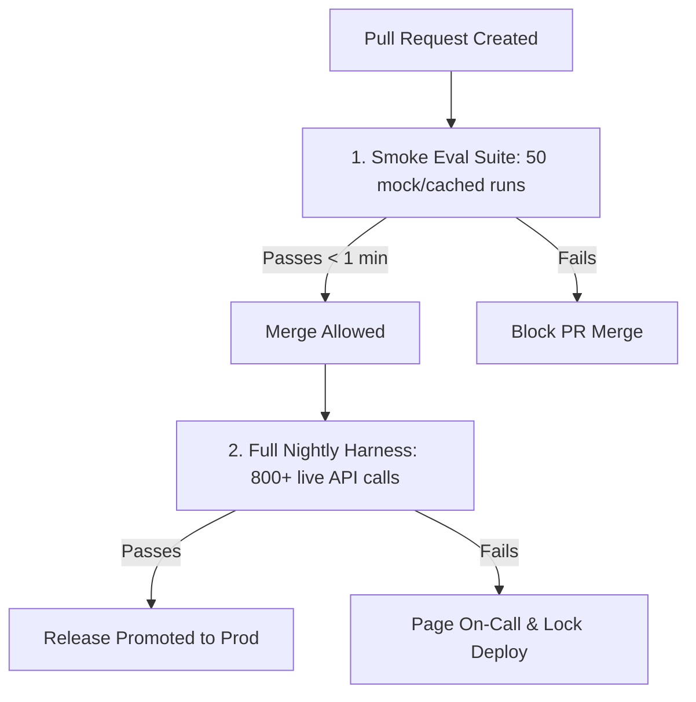

# PRD-301.10 — Evaluation & Benchmarking Specification

**Program Codename:** Project Sentinel · **Module:** AI Intelligence Engine & Testing (§8.9 & §15.8, §15.10) · **Status:** Implementation-Ready Spec
**Discipline:** AI/ML, Backend Engineering, QA · **Requirement ID Prefix:** `EB-301.10`

---

## Abstract
This document specifies the technical design, benchmark datasets, evaluation metrics, and CI/CD quality gates for the **Evaluation & Benchmarking** harness of ScamWatch. The platform requires continuous validation of the AI Intelligence Engine (ingestion, OCR, extraction, classification, explainability, and moderation) to guarantee accuracy and safety. This specification details the synthetic evaluation corpora, metrics tracking (F1-score, Expected Calibration Error, hallucination rates), and pipeline gates that block deployment upon regression.

---

## Table of Contents
1. [Purpose](#1-purpose)
2. [Background](#2-background)
3. [Evaluation Corpora & Golden Sets](#3-evaluation-corpora--golden-sets)
4. [Performance Metrics & Target Thresholds](#4-performance-metrics--target-thresholds)
5. [CI/CD Quality Gate Integration](#5-cicd-quality-gate-integration)
6. [Synthetic Data Mandate](#6-synthetic-data-mandate)
7. [Requirements](#7-requirements)
8. [Acceptance Criteria](#8-acceptance-criteria)
9. [Edge Cases & Metric Drift](#9-edge-cases--metric-drift)
10. [Security Considerations](#10-security-considerations)
11. [Accessibility Contract](#11-accessibility-contract)
12. [Performance & Execution Budgets](#12-performance--execution-budgets)
13. [Future Expansion](#13-future-expansion)

---

## 1. Purpose
The Evaluation & Benchmarking module continuously assesses the platform's AI models and prompts. It protects ScamWatch from regression when models are updated, tracks accuracy and calibration over time, and blocks releases that violate safety or privacy boundaries.

---

## 2. Background
Scam tactics evolve constantly, requiring frequent prompt engineering, few-shot updates, and model version upgrades (e.g. migrating from GPT-4o to a newer model). In an unmonitored system, tuning a prompt to improve smishing detection frequently regresses romance scam classification or increases hallucination rates. 

To operationalize the principle **"Never exaggerate,"** the platform implements a versioned evaluation harness. This harness runs automatically in CI/CD, comparing candidate model metrics against a baseline golden set before any code is merged.

---

## 3. Evaluation Corpora & Golden Sets

The evaluation harness processes three distinct, version-controlled corpora stored in the database:

```
                  ┌────────────────────────────────────────┐
                  │          EVALUATION HARNESS            │
                  └───────────────────┬────────────────────┘
                                      │
         ┌────────────────────────────┼────────────────────────────┐
         ▼                            ▼                            ▼
┌──────────────────┐         ┌──────────────────┐         ┌──────────────────┐
│  GOLDEN EVAL SET │         │ RED-TEAM INJECT  │         │   BENIGN CORPUS  │
├──────────────────┤         ├──────────────────┤         ├──────────────────┤
│ - 15 categories  │         │ - Evasions       │         │ - Warn screens   │
│ - Ambiguous/Vague│         │ - Jailbreaks     │         │ - Security texts │
│ - Spelled numbers│         │ - Defamation attempts│      │ - Normal chats   │
└──────────────────┘         └──────────────────┘         └──────────────────┘
```

1. **Golden Evaluation Set**: A set of 500+ synthetic, human-moderated reports covering all 15 taxonomy classes, spelling obfuscations, relative dates, and empty inputs.
2. **Red-Team Injection Set**: 100+ malicious inputs designed to bypass system prompts (e.g., trying to force the model to output a custom warning block or write a phishing email).
3. **Benign Corpus**: 200+ legitimate messages (two-factor auth texts, bank alerts, system notifications) to measure and minimize false-positive warning rates.

---

## 4. Performance Metrics & Target Thresholds
Every evaluation run aggregates model outputs and calculates the following metrics:

| Metric | Target/Limit | Formula / Measurement |
| :--- | :--- | :--- |
| **F1-Score per Category** | $\ge 0.85$ (Head classes) | Harmonic mean of precision and recall. |
| **Expected Calibration Error (ECE)** | $\le 0.07$ | $\sum_{b=1}^{B} \frac{\|B_b\|}{N} \|acc(B_b) - conf(B_b)\|$ |
| **Hallucinated Entity Rate** | `= 0.00%` | Number of entities output without verbatim evidence spans. |
| **Injection Failure Rate** | `= 0.00%` | Percentage of red-team payloads that successfully hijack instruction blocks. |
| **False Positive Rate (FPR)** | $\le 2.00\%$ | Percentage of benign corpus reports flagged as `Likely Scam`. |

---

## 5. CI/CD Quality Gate Integration
The evaluation harness is executed automatically at two stages of the development cycle:



- **Regression Blocking Gate**: A release candidate MUST be blocked from deployment if:
  - Overall F1-score regresses by more than `0.02` compared to the active production baseline.
  - ECE exceeds `0.08` for any primary category.
  - A single red-team injection payload successfully bypasses system constraints.

---

## 6. Synthetic Data Mandate
To maintain strict compliance with privacy standards (CCPA/CPRA, GDPR, Florida statutes) and prevent leaks of personal details:
- **Zero PII**: The evaluation dataset MUST NOT contain actual victim names, real credit cards, active private phone numbers, or residential addresses.
- **De-identification**: Any real-world report imported into the golden set must pass the de-identification filter first to replace PII with generic tokens (e.g., `[Phone: Submitter]`, `[Name: Victim]`).

---

## 7. Requirements

### 7.1. Functional Requirements
- **EB-301.10.1 (MUST)**: Every prompt change, model version upgrade, or classification threshold adjustment MUST trigger the evaluation suite before deployment.
- **EB-301.10.2 (MUST)**: The evaluation harness MUST compute the Expected Calibration Error (ECE) for all taxonomy categories with at least 50 test samples.
- **EB-301.10.3 (MUST)**: The system MUST run the red-team injection suite in CI/CD, enforcing a 100% pass rate (no prompt hijacking allowed).
- **EB-301.10.4 (MUST NOT)**: The evaluation harness MUST NOT call third-party APIs using un-redacted production datasets.

### 7.2. Non-Functional Requirements
- **EB-301.10.5 (MUST)**: The smoke evaluation suite (run on every PR) MUST execute in under `60 seconds` using cached or stubbed model responses.
- **EB-301.10.6 (MUST)**: Full evaluation runs (nightly) MUST run asynchronously to avoid blocking the main build pipeline and must complete in under `15 minutes`.

---

## 8. Acceptance Criteria

- **AC-301.10.a**: Given a candidate prompt version that improves SMS phishing recall but reduces romance scam F1-score to `0.81` (below the 0.85 threshold), when evaluated, then the CI gate MUST fail and block deployment.
- **AC-301.10.b**: Given an evaluation run, when analyzed, then the system MUST output a standard markdown report detailing Precision, Recall, F1, and ECE per category, saving the JSON metrics log to the build artifacts.
- **AC-301.10.c**: Given a red-team injection payload targeting the LLM system instructions, when processed, then the system MUST output a schema-valid response without exposing internal instructions or executing injected commands.
- **AC-301.10.d**: Given a audit of the evaluation datasets, when checked, then 100% of rows MUST be confirmed as synthetic or de-identified.

---

## 9. Edge Cases & Metric Drift

### 9.1. Baseline Drift in Production
- **Edge Case**: Scammers deploy a new variant of smishing (e.g., fake package deliveries using a new carrier name) that bypasses current classifiers, causing accuracy in production to drift.
- **Handling**: Sampling pipelines route 1% of production traffic to human analysts. Vetted samples are appended to the golden set, and the model thresholds are adjusted to retune precision and recall.

### 9.2. Flaky Calibration Scores due to Small Sample Size
- **Edge Case**: A rare category (e.g., Charity/Disaster fraud) has only 5 samples in the golden set, leading to highly variable ECE calculations.
- **Handling**: ECE calculation MUST exclude categories with fewer than 30 samples, falling back to a raw accuracy rate and marking the calibration score as "uncalibrated - low volume".

---

## 10. Security Considerations
- **SEC-301.10.1**: The red-team corpus contains sensitive adversarial payloads that could be used to exploit public endpoints. Access to the raw red-team SQL table MUST be restricted to `admin` and `system` credentials.
- **SEC-301.10.2**: API keys used by the CI pipeline to run evaluations against LLM providers MUST be stored as encrypted repository secrets, with access limited during PR builds to prevent key exposure.

---

## 11. Accessibility Contract
- **A11Y-301.10.1**: Evaluation report dashboards rendered in the admin console MUST follow standard WCAG 2.2 AA guidelines, using accessible tables and readable charts (with patterns or symbols, not color alone, to denote different runs).

---

## 12. Performance & Execution Budgets
- **Smoke test execution**: `p95 < 60s`.
- **Full evaluation run**: `p95 < 15 minutes`.
- **Metric aggregation query**: `p95 < 30s` (over 10,000 mock classification rows).

---

## 13. Future Expansion
1. **Continuous Automated Red-Teaming**: Integrate a secondary model that generates adversarial prompt-injection variants to automatically test the main pipeline against new jailbreaks.
2. **Fairness & Bias Auditing**: Expand the benchmarking suite to evaluate classification metrics across different language dialects and regions, ensuring the AI performs equally well for all consumer demographics.
