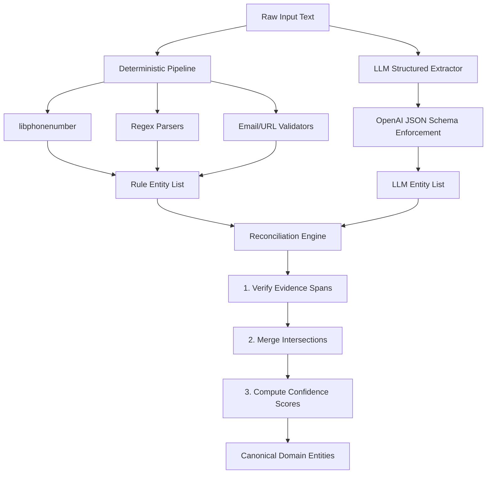

# PRD-301.2 — Entity Extraction Specification

**Program Codename:** Project Sentinel · **Module:** AI Intelligence Engine (§8.3) · **Status:** Implementation-Ready Spec
**Discipline:** AI/ML, Backend Engineering, QA · **Requirement ID Prefix:** `EE-301.2`

---

## Abstract
This document specifies the engineering design, data schemas, normalization logic, and reconciliation algorithms for the **Entity Extraction** module of ScamWatch. The module is responsible for parsing raw unstructured text (including transcripts from voice intake, OCR streams from screenshots, and email payloads) to extract canonical atoms of fraud infrastructure (**Entities**). It implements a hybrid pipeline combining deterministic rules with a schema-constrained Large Language Model (LLM) extractor, enforcing a zero-network-lookup security contract during the extraction phase.

---

## Table of Contents
1. [Purpose](#1-purpose)
2. [Background](#2-background)
3. [Core Pipeline Architecture & Reconciliation](#3-core-pipeline-architecture--reconciliation)
4. [Entity-Specific Technical Specifications](#4-entity-specific-technical-specifications)
5. [JSON Schema for LLM Extractor](#5-json-schema-for-llm-extractor)
6. [Requirements](#6-requirements)
7. [Acceptance Criteria](#7-acceptance-criteria)
8. [Edge Cases & Error Handling](#8-edge-cases--error-handling)
9. [Security & Privacy Considerations](#9-security--privacy-considerations)
10. [Accessibility Contract](#10-accessibility-contract)
11. [Performance & Latency Budgets](#11-performance--latency-budgets)
12. [Future Expansion](#12-future-expansion)

---

## 1. Purpose
The primary purpose of the Entity Extraction module is to isolate and catalog individual pieces of contact, payment, and operational infrastructure used by threat actors to execute scams. By converting variable and obfuscated text into structured, canonical **Entity** objects, ScamWatch can:
1. Query the **Knowledge Graph** (Volume 9) to link a new report to historic threat infrastructure.
2. Calculate overlapping indicator clusters to detect emerging **Campaigns** (Volume 8 §8.5).
3. Generate structured, evidence-based **Explanations** (Volume 8 §8.7) that show consumers exactly which parts of a message match known fraud vectors.

---

## 2. Background
Scammers routinely obfuscate infrastructure indicators to bypass automated gateways and spam filters. Common techniques include:
- **Obfuscating URLs**: Using `hxxp`, `paypa1[.]com`, or wrapping URLs in redirects.
- **Obfuscating Phones**: Writing digits as words ("five five five o one zero zero") or using alternative unicode characters.
- **Payment Handles**: Emphasizing peer-to-peer (P2P) handles (Zelle, Venmo, CashApp) within image context to evade text scrapers.

Deterministic parsers (e.g., regexes or `libphonenumber`) are fast and precise on clean text but fail on obfuscated variants. Conversely, LLMs are highly resilient to spelling variations and context clues but are prone to hallucinating entities that do not exist in the source text. 

This specification establishes a **hybrid pipeline** that runs both deterministic rules and a constrained LLM parser, reconciling them through a strict verification logic.

---

## 3. Core Pipeline Architecture & Reconciliation
The extraction pipeline operates as a stateless backend service (deployed as a Supabase Edge Function) executing the following workflow:



### The Reconciliation Algorithm
Given $E_{rule}$ (the set of entities extracted by deterministic rules) and $E_{llm}$ (the set of entities extracted by the LLM):

1. **Evidence-Span Validation**:
   For every entity $e \in E_{llm}$, the pipeline MUST verify that the `evidence_span` string exists verbatim in the source text (case-insensitive, whitespace-normalized). If the span does not exist, the entity MUST be discarded to prevent LLM hallucinations (`AC-301.2.c`).
   
2. **Merging Logic**:
   - **Case A: Exact Match**: If $e_{rule}$ and $e_{llm}$ match on `canonical_value` and `type`, they are merged into a single Entity with `source = "both"` and the confidence score is elevated.
   - **Case B: Obfuscation Resolution**: If $e_{llm}$ represents an obfuscated value (e.g., `paypa1[.]com`) and $e_{rule}$ extracted nothing (due to regex failure), the LLM entity is retained with `source = "llm"` and `raw_value = "paypa1[.]com"`.
   - **Case C: Rule Capture Only**: If $e_{rule}$ matches a phone number or URL but the LLM omitted it, the entity is retained with `source = "rule"` and `confidence` set to the rule's default base.

---

## 4. Entity-Specific Technical Specifications

This section defines the extraction, normalization, and validation rules for the nine required entity types.

### 4.1. URLs
- **Definition**: Web links, phish lures, and redirection links.
- **Normalization**:
  1. Parse the scheme (default to `https://` if missing or if using `hxxp`/`hxxps`).
  2. Lowercase the hostname.
  3. Strip default ports (`80` for HTTP, `443` for HTTPS).
  4. Punycode-decode the domain (e.g., `xn--pypal-qqa.com` $\to$ `paypаl.com`) to expose homograph/lookalike attacks.
  5. Retain the exact path and query parameters for forensic linking, but strip tracking tokens (e.g., `fbclid`, `utm_source`).
- **Obfuscation Handling**: Replace bracketed dots (e.g., `[.]` or `(.)`) and forward slash bypasses (e.g., `paypa1.com\login`) prior to normalizer processing.

### 4.2. Domains
- **Definition**: The host portion of a URL, or standalone domain names.
- **Normalization**:
  1. Lowercase the host string.
  2. Extract the registrable domain (second-level domain + top-level domain) using the canonical **Public Suffix List** (e.g., `sub.paypa1.co.uk` $\to$ `paypa1.co.uk`).
- **Validation**: Domain MUST match the standard RFC 1035 domain name format. Standalone hostnames without a valid TLD are classified as `BrandName` instead of `Domain`.

### 4.3. Emails
- **Definition**: Email addresses representing the sender, reply-to, or contact channels.
- **Normalization**:
  1. Split into local part and domain part at the last `@` character.
  2. Lowercase the domain part.
  3. For known providers (Gmail, Outlook, iCloud), strip dots and sub-addressing (e.g., `victim.name+scam@gmail.com` $\to$ `victimname@gmail.com`) for internal graph-linking, but keep the raw string as the display alias.
- **Obfuscation Handling**: Extract email format from written forms such as `victim [at] domain (dot) com`.

### 4.4. Phone Numbers
- **Definition**: Mobile, landline, Toll-Free, or VoIP phone numbers.
- **Normalization**:
  - Parse using Google's `libphonenumber` library.
  - Normalize to **E.164** format (e.g., `+15558675309`).
  - If no country code is present, default to the launch region country code (`+1` for North America/Florida).
- **Obfuscation Handling**:
  - The LLM MUST parse alphabetic sequences representing numbers (e.g., `1-800-PAY-SCAM` $\to$ `+18007297226`).

### 4.5. Organizations / Brands
- **Definition**: Established companies, government agencies, or platforms impersonated by the scammer.
- **Normalization**:
  - Resolve variations and common abbreviations to a canonical brand directory node (e.g., "IRS", "Internal Revenue Service", "Gov IRS" $\to$ `Internal Revenue Service`).
- **Validation**: Organizations must be matched against a localized reference list of high-value targets (utilities, banks, federal agencies). If no match is found, retain the raw extracted name with a lower baseline confidence.

### 4.6. Dates
- **Definition**: Dates/times of the scam contact, payment deadlines, or threat deadlines.
- **Normalization**:
  - Convert to ISO-8601 extended format (`YYYY-MM-DD` or `YYYY-MM-DDTHH:MM:SSZ`).
  - Resolve relative timestamps (e.g., "by tomorrow at noon" relative to the `Report` submission timestamp).

### 4.7. Payment Requests
- **Definition**: Instructions to transfer funds. Includes crypto wallets, peer-to-peer handles, and voucher codes.
- **Normalization**:
  - **Crypto Address**: Retain base58/bech32 checksummed address (e.g., Bitcoin `1A1zP1eP...`, Ethereum `0x71C...`).
  - **P2P Handle**: Canonicalize Zelle (email/phone), Venmo (`@handle`), CashApp (`$handle`).
  - **Gift Cards**: Clean alphanumeric code formatting (remove spaces/dashes).
- **Validation**: Crypto addresses MUST pass EIP-55 (for Ethereum) or Base58Check (for Bitcoin) validation; invalid hashes are flagged as `suspected` with confidence capped at `0.10` (`AC-301.2.d`).

### 4.8. Case / Ticket Numbers
- **Definition**: Fake reference numbers used by scammers to project authority (e.g., "Ref: FTC-8921-A").
- **Normalization**: Strip non-alphanumeric decorators, spaces, and leading zeros (e.g., `FTC-00921` $\to$ `FTC921`).

### 4.9. Extraction Confidence Scoring
Every extracted Entity MUST be assigned a confidence score $C \in [0.0, 1.0]$. The score is calculated based on the extraction channel:

| Source Channel | Base Confidence | Adjustments / Flags |
| :--- | :--- | :--- |
| **Deterministic Rules Only** | `0.95` | Cap at `0.50` if syntax validation fails. |
| **LLM Only (Constrained)** | `0.85` | Reduce by `0.15` if the `evidence_span` requires spelling correction. |
| **Both Channels (Reconciled)** | `0.99` | Set to maximum confidence. |
| **Suspected Obfuscation** | `0.70` | Cap at `0.50` if checksum/structural format is irregular. |

---

## 5. JSON Schema for LLM Extractor
The LLM extractor MUST be invoked with OpenAI structured outputs enabled (`response_format={"type": "json_object"}`), utilizing the following JSON schema:

```json
{
  "$schema": "http://json-schema.org/draft-07/schema#",
  "title": "ExtractedEntities",
  "type": "object",
  "properties": {
    "entities": {
      "type": "array",
      "items": {
        "type": "object",
        "properties": {
          "type": {
            "type": "string",
            "enum": ["url", "domain", "email", "phone", "organization", "date", "payment_handle", "case_number"]
          },
          "raw_value": {
            "type": "string",
            "description": "The exact string segment containing the entity value as written in the text."
          },
          "evidence_span": {
            "type": "string",
            "description": "The verbatim surrounding sentence or phrase containing the entity, used for hallucination checks."
          },
          "normalized_hint": {
            "type": "string",
            "description": "The LLM's proposed canonical format (e.g. converting spelled-out numbers or resolving relative dates)."
          }
        },
        "required": ["type", "raw_value", "evidence_span"],
        "additionalProperties": false
      }
    }
  },
  "required": ["entities"],
  "additionalProperties": false
}
```

---

## 6. Requirements

### 6.1. Functional Requirements
- **EE-301.2.1 (MUST)**: The system MUST run deterministic extractors first, caching their outputs before calling the LLM extractor.
- **EE-301.2.2 (MUST)**: If the input text is empty or contains only whitespace, the pipeline MUST bypass the LLM and return an empty entity array immediately.
- **EE-301.2.3 (MUST)**: The system MUST normalize all phone numbers to E.164 format and all hostnames to lowercase.
- **EE-301.2.4 (MUST)**: The system MUST flag homograph attacks in domains using Punycode decoding.
- **EE-301.2.5 (MUST NOT)**: The system MUST NOT execute any network operations (e.g. DNS resolution, HTTP calls) during the extraction process.

### 6.2. Non-Functional Requirements
- **EE-301.2.6 (MUST)**: The p95 execution time for the synchronous rules stage MUST be under `100ms`.
- **EE-301.2.7 (MUST)**: The total p95 execution time for the combined pipeline (rules + LLM) MUST be under `2.5 seconds` for input payloads under 4 KB.
- **EE-301.2.8 (SHOULD)**: The pipeline SHOULD gracefully degrade to rules-only extraction during LLM rate limits or outages, tagging the payload with `degraded=true`.

---

## 7. Acceptance Criteria

- **AC-301.2.a**: Given the string `"Call 5 5 5-867-5309 now"`, when processed, then the system MUST output a phone Entity with `canonical_value = "+15558675309"`.
- **AC-301.2.b**: Given the string `hxxp://paypa1[.]com/login`, when processed, then the system MUST output a URL Entity with `canonical_value = "https://paypa1.com/login"` and flag the lookalike domain.
- **AC-301.2.c**: Given an LLM output entity whose `evidence_span` is absent from the source text, when reconciled, then the system MUST drop that entity and log a validation warning.
- **AC-301.2.d**: Given an Ethereum address with an invalid EIP-55 checksum, when processed, then the system MUST flag the entity as `suspected` and cap its confidence score at `0.10`.
- **AC-301.2.e**: Given an input payload that exceeds 4 KB, when processed, then the pipeline MUST truncate the text at a sentence boundary before calling the LLM.

---

## 8. Edge Cases & Error Handling

### 8.1. Obfuscated Substrings in Legitimate Domains
- **Edge Case**: A report contains a URL pointing to a legitimate site that happens to contain fraud keywords (e.g., `https://support.google.com/answer/12345`).
- **Handling**: The system MUST extract the domain `google.com` as a legitimate brand node, avoiding false-positive flagging by validating the host against a static high-value whitelist.

### 8.2. Broken LLM JSON Payloads
- **Edge Case**: The LLM outputs malformed JSON or violates the structured schema.
- **Handling**: The reconciliation layer MUST catch the parsing exception, reject the LLM output, log the schema failure to OpenTelemetry, and fall back to the deterministic rule set with `degraded=true`.

---

## 9. Security & Privacy Considerations
- **SEC-301.2.1**: The extraction edge function operates in a sandbox. It MUST NOT make outbound connections to URL hosts parsed from the reports, preventing adversaries from detecting automated analysis via DNS/web log correlation.
- **SEC-301.2.2**: PII (emails, phone numbers, names) extracted during this phase MUST be stored in encrypted database columns (using `pgcrypto` or pgsodium authenticated encryption) with access restricted via Row Level Security (RLS) to authorized analysts only.

---

## 10. Accessibility Contract
Downstream interfaces presenting these extracted entities to users (such as warning modals or explanation panels) MUST follow these rules:
- **A11Y-301.2.1**: Extracted values (e.g., a phone number inside an alert) MUST be presented with explicit aria-labels indicating the entity type (e.g., `aria-label="Flagged Phone Number: +15558675309"`).
- **A11Y-301.2.2**: Highlighting of indicators in the UI MUST NOT rely on color contrast alone (e.g., red text). Warning icons and descriptive text badges MUST be displayed alongside the highlighted text.

---

## 11. Performance & Latency Budgets
- **Rule Processing Pipeline**: `p50 < 20ms`, `p95 < 100ms`.
- **LLM API Request**: `p50 < 1.2s`, `p95 < 2.4s`.
- **Reconciliation Layer**: `p50 < 5ms`, `p95 < 15ms`.
- **Global Timeout**: The gateway router enforces a strict `3.0s` hard deadline. If exceeded, the engine terminates the LLM stream and returns the cached rule-based entities.

---

## 12. Future Expansion
1. **Real-time Safe-sandboxing**: Future versions will pipe extracted URLs into an isolated, headless browser container running on a distinct proxy network to capture screenshots of dynamic phishing kits.
2. **Deepfake Voice Print Hash**: Future support for voice calls will extract voice prints (biometric hashes) as unique Entities to link robocall scams across lines.
