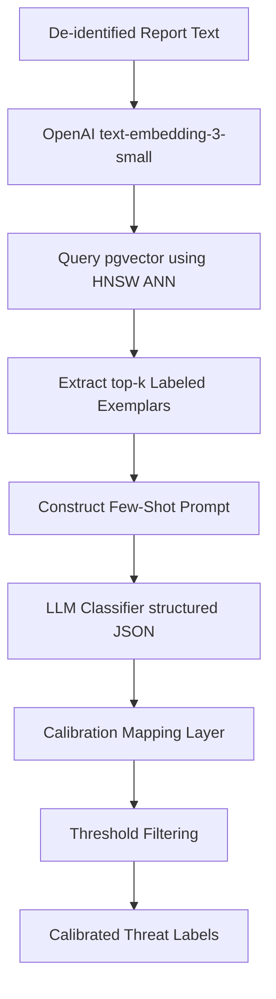

# PRD-301.3 — Threat Classification Specification

**Program Codename:** Project Sentinel · **Module:** AI Intelligence Engine (§8.4) · **Status:** Implementation-Ready Spec
**Discipline:** AI/ML, Backend Engineering, QA · **Requirement ID Prefix:** `TC-301.3`

---

## Abstract
This document specifies the technical design, system architecture, validation protocols, and performance metrics for the **Threat Classification** engine of ScamWatch. The engine is responsible for mapping normalized user reports to the platform's controlled threat taxonomy. It utilizes a retrieval-augmented few-shot pipeline over `pgvector` with post-classification calibration (via isotonic regression or Platt scaling), supporting multi-label classification and automated abstention when confidence boundaries are not met.

---

## Table of Contents
1. [Purpose](#1-purpose)
2. [Background](#2-background)
3. [Controlled Threat Taxonomy](#3-controlled-threat-taxonomy)
4. [RAG Classifier Pipeline Architecture](#4-rag-classifier-pipeline-architecture)
5. [Confidence Calibration Engine](#5-confidence-calibration-engine)
6. [Requirements](#6-requirements)
7. [Acceptance Criteria](#7-acceptance-criteria)
8. [Edge Cases & Alignment Rules](#8-edge-cases--alignment-rules)
9. [Security Considerations](#9-security-considerations)
10. [Accessibility Contract](#10-accessibility-contract)
11. [Performance & Latency Budgets](#11-performance--latency-budgets)
12. [Future Expansion](#12-future-expansion)

---

## 1. Purpose
The Threat Classification engine categorizes user-reported scams into specific patterns (e.g. romance scams, tech support impersonation, utility smishing). Accurate classification is essential to:
1. Trigger targeted, context-specific **Recommendations** and **Verifications** (e.g., routing IRS impersonation to the Treasury Inspector General).
2. Connect reports to active **Campaigns** (Volume 8 §8.5) utilizing similar tactics.
3. Structure user-facing **Explanations** (Volume 8 §8.7) that describe the mechanics of the identified scam type.

---

## 2. Background
Pure zero-shot Large Language Model (LLM) classification suffers from several problems in production:
- **Poor Calibration**: LLMs tend to output high confidence scores (e.g., 0.99) even when wrong, or low confidence when correct.
- **Concept Drift**: As threat actors evolve their methods, static prompt instructions fail to capture new variants.
- **Single-Label Limitations**: Scam messages are frequently hybrid (e.g. government impersonation delivered via SMS smishing).

This specification addresses these limitations by utilizing a **Retrieval-Augmented Generation (RAG)** classifier. By retrieving real, verified historic exemplars matching the incoming text's embeddings, the LLM receives in-context "few-shot" guidance. A statistical calibration layer then scales the raw LLM output to reflect real-world probabilities.

---

## 3. Controlled Threat Taxonomy
The classifier MUST only emit categories defined in the platform's controlled taxonomy (`_shared-context.md` §11). The primary categories are:

1. **Phishing / Smishing / Vishing**
2. **Impersonation** (Gov't, Bank, Brand, Family)
3. **Investment / Crypto** (including Pig-Butchering)
4. **Romance Scams**
5. **Tech Support Scams**
6. **Employment / Job Scams**
7. **Marketplace / Goods Scams**
8. **Refund / Overpayment Scams**
9. **Lottery / Prize Scams**
10. **Charity / Disaster Scams**
11. **Extortion / Sextortion**
12. **Identity Theft**
13. **Account Takeover**
14. **Fake Invoices / BEC (Business Email Compromise)**
15. **Subscription / Free-Trial Traps**

---

## 4. RAG Classifier Pipeline Architecture

The classification sequence executes across three distinct layers (Embedding, Retrieval, Classification):



### 4.1. Embedding & Retrieval Layer
1. **De-identification Check**: Payloads MUST pass the de-identification gate (Volume 8 §8.10) to remove direct user PII before generating embeddings.
2. **Embedding**: Generate a 1536-dimensional vector using `text-embedding-3-small`.
3. **pgvector Query**: Perform an approximate nearest neighbor (ANN) search on the `exemplars` table using the cosine distance operator (`<=>`) against an **HNSW** index:
   ```sql
   SELECT id, category, normalized_text, cosine_distance 
   FROM exemplars 
   ORDER BY embedding <=> $1 
   LIMIT $2;
   ```

### 4.2. In-Context Few-Shot Prompting
The retrieved $k$ exemplars (default $k=8$) are injected into the prompt context. The prompt template includes:
- Canonical descriptions of each taxonomy category.
- The $k$ exemplars with their verified human-assigned labels.
- The target report text.

---

## 5. Confidence Calibration Engine
Raw scores output by the LLM (e.g. `confidence_raw`) do not represent true probabilities. The calibration engine applies a statistical scaling map:

$$\text{Confidence}_{\text{calibrated}} = f(\text{Confidence}_{\text{raw}})$$

- **Calibration Method**: The service utilizes **Isotonic Regression** (or Platt Scaling for low-volume categories) calibrated against a static test set of human-labeled reports.
- **Abstention Boundary**: If the calibrated confidence score for all categories fails to cross the configured threshold $\theta_{\text{abstain}}$ (default `0.45`), the engine MUST set `abstained = true` and categorize the report as `unknown`.
- **Taxonomy Gap Detection**: If the maximum cosine similarity score from the exemplar retrieval is below `0.30` (indicating the scam type is unlike any known pattern), the system MUST flag `taxonomy_gap_suspected = true` to alert human analysts.

---

## 6. Requirements

### 6.1. Functional Requirements
- **TC-301.3.1 (MUST)**: Classification MUST be multi-label, returning independent confidence scores for every applicable category.
- **TC-301.3.2 (MUST)**: Embeddings MUST ONLY be generated on text that has passed the de-identification filter.
- **TC-301.3.3 (MUST)**: Raw LLM output scores MUST be calibrated using Isotonic Regression maps before database storage or user display.
- **TC-301.3.4 (MUST)**: The system MUST support abstention, returning `unknown` when no label crosses $\theta_{\text{abstain}}$.
- **TC-301.3.5 (MUST NOT)**: The classifier MUST NOT emit categories outside the controlled taxonomy.

### 6.2. Non-Functional Requirements
- **TC-301.3.6 (MUST)**: pgvector retrieval over the HNSW index MUST complete in under `80ms` p95.
- **TC-301.3.7 (MUST)**: The total classification pipeline latency (embed + retrieve + classify) MUST be under `3.0s` p95 on the fast path.
- **TC-301.3.8 (MUST)**: The classification thresholds and calibration maps MUST be configurable dynamically (via database parameters) without redeploying code.

---

## 7. Acceptance Criteria

- **AC-301.3.a**: Given a government utility smishing text, when classified, then `Phishing/Smishing/Vishing` and `Impersonation (gov't)` MUST both be returned with calibrated scores above the label threshold.
- **AC-301.3.b**: Given a vague report (e.g., "Hi, how are you?"), when classified, then the system MUST set `abstained = true` and label the report as `unknown`.
- **AC-301.3.c**: Given an evaluation run against a calibration verification set, when analyzed, then the Expected Calibration Error (ECE) MUST be less than `0.07` for the primary categories.
- **AC-301.3.d**: Given a query yielding `max_similarity < 0.30` from `pgvector`, when classified, then the system MUST flag `taxonomy_gap_suspected = true`.

---

## 8. Edge Cases & Alignment Rules

### 8.1. Legit Brand Phishing Lures
- **Edge Case**: A report contains a message mimicking a bank alert (e.g., "Alert: Chase Bank - Click here to login").
- **Handling**: The system MUST classify this as `Impersonation (bank)` and `Phishing/Smishing/Vishing`, referencing the Chase brand in the rationale, rather than misclassifying it as a legitimate financial update.

### 8.2. Multilingual Inputs
- **Edge Case**: The report text is submitted in Spanish or Creole.
- **Handling**: The prompt template MUST instruct the LLM to translate the payload internally before classification, applying the standard English taxonomy. If translation accuracy is low, cap the confidence score at `0.60`.

---

## 9. Security Considerations
- **SEC-301.3.1**: Labeled exemplars stored in the database and retrieved into the prompt MUST be verified and pre-scrubbed of all PII. Under no circumstances should unvetted user submissions be used directly as exemplars, preventing prompt injection attacks.
- **SEC-301.3.2**: Classifier instructions in the LLM system role MUST be clearly separated from the user data block using delimiter boundaries (e.g. `[REPORT_START] ... [REPORT_END]`) to prevent payload text from overriding model behavior.

---

## 10. Accessibility Contract
- **A11Y-301.3.1**: Verdicts displayed in the UI MUST represent confidence in calibrated percentage bands or explicit words (e.g., "High Confidence", "Moderate Signal") rather than depending exclusively on color codes.
- **A11Y-301.3.2**: Screen readers MUST receive descriptive text explaining the classification rationale (e.g., `"Scam Type: Phishing. Reason: Contains a lookalike domain."`).

---

## 11. Performance & Latency Budgets
- **Embedding Generation**: `p50 < 300ms`, `p95 < 600ms`.
- **pgvector HNSW Retrieval**: `p50 < 10ms`, `p95 < 80ms`.
- **LLM Inference Call**: `p50 < 1.2s`, `p95 < 2.0s`.
- **Calibration & Filtering**: `p50 < 2ms`, `p95 < 10ms`.
- **Total Latency**: `p50 < 1.6s`, `p95 < 3.0s`.

---

## 12. Future Expansion
1. **Model Distillation**: Train a smaller, fine-tuned transformer model (e.g. a DeBERTa or DistilBERT variant) on the platform's labeled dataset to execute threat classification locally on Supabase Edge without third-party API latency.
2. **Threat Level Severity Scoring**: Introduce a secondary classifier to evaluate threat severity based on direct financial risk or urgency markers, enabling priority routing for high-risk exploits.
