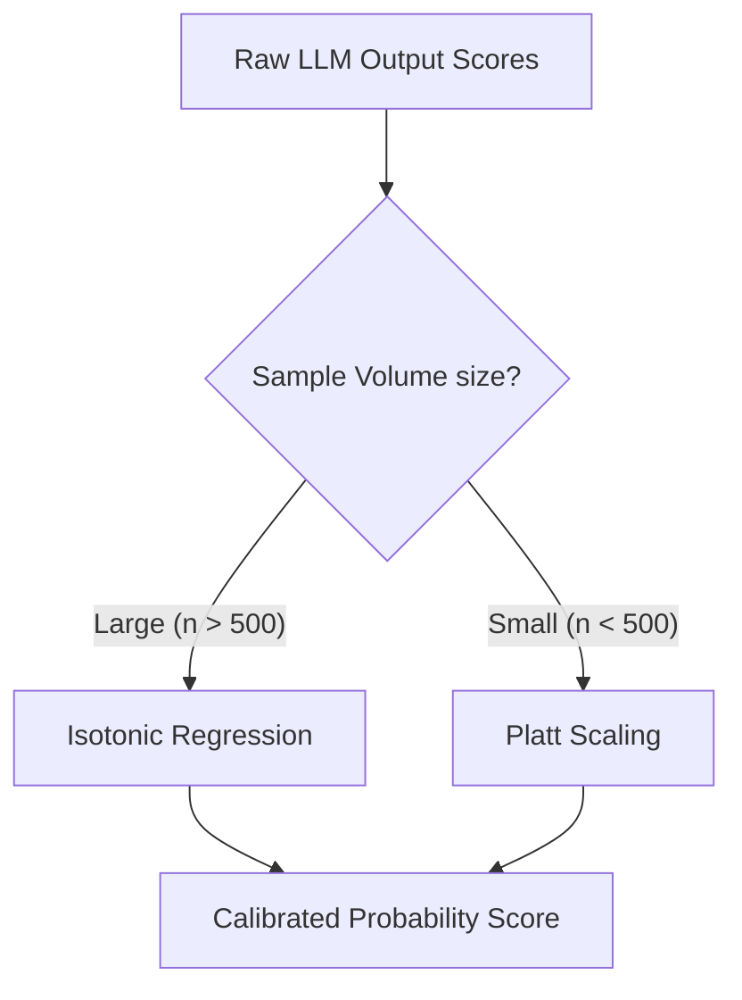

# PRD-301.4 — Confidence Scoring Specification

**Program Codename:** Project Sentinel · **Module:** AI Intelligence Engine (§8.9 & §8.4) · **Status:** Implementation-Ready Spec
**Discipline:** AI/ML, Backend Engineering, UX Design, QA · **Requirement ID Prefix:** `CS-301.4`

---

## Abstract
This document specifies the technical design, mathematical scaling algorithms, threshold gates, and user-facing presentation rules for the **Confidence Scoring** framework of ScamWatch. The platform requires all automated outputs (entities, threat classifications, and campaign links) to carry calibrated confidence metrics. This specification details the calibration pipeline (utilizing Isotonic Regression and Platt Scaling), defines the boundaries for model abstention, and establishes the accessibility guidelines for presenting uncertainty to users.

---

## Table of Contents
1. [Purpose](#1-purpose)
2. [Background](#2-background)
3. [The Calibrated Confidence Model](#3-the-calibrated-confidence-model)
4. [Calibration Algorithms](#4-calibration-algorithms)
5. [Evidence & Abstention Thresholds](#5-evidence--abstention-thresholds)
6. [Uncertainty Language & UI Presentation](#6-uncertainty-language--ui-presentation)
7. [Requirements](#7-requirements)
8. [Acceptance Criteria](#8-acceptance-criteria)
9. [Edge Cases & Failure Recovery](#9-edge-cases--failure-recovery)
10. [Security & Poisoning Protections](#10-security--poisoning-protections)
11. [Accessibility Contract](#11-accessibility-contract)
12. [Performance Budgets](#12-performance-budgets)
13. [Future Expansion](#13-future-expansion)

---

## 1. Purpose
The primary purpose of the Confidence Scoring module is to prevent automated systems from presenting predictions as absolute facts. Calibrated scoring maintains documentation integrity, prevents false accusations against legitimate entities, and alerts users to the exact strength of the evidence behind a warning.

---

## 2. Background
In-production Large Language Models are notoriously overconfident, often outputting probabilities close to `0.99` for incorrect classifications. This behavior violates the project's core principle: **"Never exaggerate."** To solve this, all raw classification scores must pass through a statistical calibration layer before being saved to the database or displayed.

---

## 3. The Calibrated Confidence Model

The system assigns confidence scores at three distinct levels of the ingestion pipeline:

```
[Raw Submission Ingest]
  ├── 1. Entity Extraction Confidence (Rule vs. LLM Reconciliation)
  ├── 2. Threat Classification Confidence (Post-Processed Calibration)
  └── 3. Campaign Linkage Correlation (Infrastructure Match Density)
```

### 3.1. Entity Extraction Confidence ($C_{\text{entity}}$)
Confidence is set deterministically based on source reconciliation (Volume 8 §8.3):
- Rules-only: `0.95`
- Reconciled (Rules + LLM): `0.99`
- LLM-only: `0.85` (reduced if the evidence span requires formatting cleanup).
- Suspected Obfuscation: `0.70` (capped at `0.50` if checksum validation fails).

### 3.2. Threat Classification Confidence ($C_{\text{threat}}$)
Calculated via model logits and mapped to a true probability using isotonic regression:

$$C_{\text{threat}} = f(S_{\text{raw}})$$

Where $S_{\text{raw}}$ is the raw logit output from the classifier, and $f$ is the mapping function.

### 3.3. Campaign Linkage Confidence ($C_{\text{campaign}}$)
Calculated based on overlapping infrastructure:

$$C_{\text{campaign}} = \text{calibrated\_combine}(w_e \cdot S_{\text{shared\_entity}} + w_t \cdot S_{\text{temporal\_burst}})$$

Where cryptographic wallets and domain matches have a higher weight ($w_e$) than phone numbers or sender names.

---

## 4. Calibration Algorithms

To convert raw scores to true probability-like values, the system implements two calibration methods:



### 4.1. Isotonic Regression (Primary)
Used for high-volume head categories (e.g. Phishing/Smishing). It fits a non-decreasing, piecewise constant function to minimize the residual sum of squares:

$$\min \sum (y_i - \hat{y}_i)^2 \quad \text{subject to} \quad \hat{y}_i \le \hat{y}_j \text{ for } x_i \le x_j$$

### 4.2. Platt Scaling (Fallback)
Used for low-volume tail categories. It applies a logistic regression model over the model outputs:

$$P(y=1 | x) = \frac{1}{1 + \exp(A \cdot f(x) + B)}$$

Parameters $A$ and $B$ are fit using maximum likelihood estimation.

---

## 5. Evidence & Abstention Thresholds

- **The Abstention Boundary ($\theta_{\text{abstain}}$)**: Set to `0.45` (post-calibration). If the maximum calibrated score is below `0.45`, classification is halted, the status is set to `unknown`, and the UI displays a generic "could not classify" notification.
- **The Warning Threshold ($\theta_{\text{warning}}$)**: Set to `0.65`. UI warnings are only displayed to the public if the calibrated confidence crosses this gate.
- **Dampening Multipliers**:
  - If OCR legibility is flagged as low (`ocr_confidence < 0.55`), multiply classification confidence by a factor of `0.80`.
  - If a domain/URL fails syntax validation, multiply by `0.50`.

---

## 6. Uncertainty Language & UI Presentation

Confidence scores are grouped into three user-facing bands to avoid conveying false precision (e.g., displaying `78.23%` suggests incorrect precision):

| Band | Range | UI Term | UI Action |
| :--- | :--- | :--- | :--- |
| **Low** | `0.00 - 0.45` | No Signal | Do not display public warning. Route to analyst queue. |
| **Moderate** | `0.45 - 0.75` | Use Caution | Display amber warning badge. Recommend standard caution. |
| **High** | `0.75 - 1.00` | Likely Scam | Display red alert badge. Show specific threat rationales. |

### Copy Examples
- **Moderate Band**: `"Use Caution (Moderate Signal): This message may match a delivery scam pattern. Double-check tracking links with the official carrier."`
- **High Band**: `"Likely Scam (High Confidence): This message contains a confirmed lookalike domain targeting Chase Bank."`

---

## 7. Requirements

### 7.1. Functional Requirements
- **CS-301.4.1 (MUST)**: All database records storing classification verdicts MUST store both the raw model score (`confidence_raw`) and the calibrated score (`confidence_calibrated`).
- **CS-301.4.2 (MUST)**: The system MUST automatically abstain (`status = unknown`) if the calibrated confidence of all taxonomy labels falls below `0.45`.
- **CS-301.4.3 (MUST)**: User-facing interfaces MUST NOT present raw decimal percentages (e.g. `83.19%`) directly to consumers, but MUST map them to the three categorical bands (Low/Moderate/High).
- **CS-301.4.4 (MUST NOT)**: No automated alert may be published with a confidence score of `1.00`. The global calibrated score is capped at `0.99` to reflect systematic model uncertainty.

### 7.2. Non-Functional Requirements
- **CS-301.4.5 (MUST)**: The calibration transformation layer MUST add less than `10ms` p95 to the overall classification execution.
- **CS-301.4.6 (MUST)**: The isotonic regression parameters MUST be updated nightly via a scheduled database cron job using historical human-moderated reports.

---

## 8. Acceptance Criteria

- **AC-301.4.a**: Given a classification raw logit mapping to `0.98` raw confidence, when calibrated via isotonic mapping, then the resulting database entry shows a calibrated score of `0.84` (reflecting actual probability boundaries).
- **AC-301.4.b**: Given an input that yields a maximum calibrated score of `0.41`, when processed, then the system MUST set `abstained = true` and hide public warning badges.
- **AC-301.4.c**: Given an OCR input with legibility set to low, when classification runs, then the system MUST apply the `0.80` dampening multiplier to the final confidence.
- **AC-301.4.d**: Given a screen reader parsing the UI, when the warning badge is reached, then the reader MUST announce: `"Warning: Likely Scam. Confidence: High."`

---

## 9. Edge Cases & Failure Recovery

### 9.1. Lack of Calibration Data for New Categories
- **Edge Case**: A new category is added to the taxonomy, but there are no historical samples to fit an isotonic curve.
- **Recovery**: The system MUST fall back to a default sigmoid scaling curve with a safety dampening factor of `0.70` until at least 100 human-labeled samples are collected in the database.

### 9.2. Conflicting Entity Scores
- **Edge Case**: A report contains a highly reputable URL (confidence `0.99`) but also a highly suspicious phone number (confidence `0.95`).
- **Recovery**: The system MUST evaluate the threat categories independently. The overall report verdict is determined by the highest-confidence negative match, keeping the safe indicator as a context-labeled exception.

---

## 10. Security & Poisoning Protections
- **SEC-301.4.1**: Attackers may try to poison the calibration system by submitting thousands of identical reports to skew the isotonic curve. The nightly cron job MUST filter training samples by submitter IP and rate-limit hashes to ensure only unique, vetted data is used.
- **SEC-301.4.2**: The calibration mapping coefficients MUST be stored in a read-only database table accessible only to the system user, protecting them from SQL injection tampering.

---

## 11. Accessibility Contract
- **A11Y-301.4.1**: UI warning badges MUST NOT rely on color (red/orange) alone to convey risk. They MUST display text labels (`Likely Scam` / `Use Caution`) and distinct geometric icon shapes (triangle for caution, octagon for alert).
- **A11Y-301.4.2**: All confidence values displayed to users MUST pass WCAG 2.2 AA color contrast ratios (minimum 4.5:1 ratio against the background card).

---

## 12. Performance Budgets
- **Calibration Curve Lookup**: `p50 < 1ms`, `p95 < 5ms`.
- **Database Nightly Fit Job**: Bounded to execute in under `5 minutes` to avoid locking database transaction tables during low-traffic windows.

---

## 13. Future Expansion
1. **Dynamic Bayesian Aggregation**: Implement a Bayesian network that combines prior category probabilities with real-time user-reported location parameters to calibrate confidence dynamically for local outbreaks.
2. **Analyst Calibration Dashboard**: Build a visualization dashboard in the admin console showing calibration reliability diagrams, enabling analysts to spot prompt drifts before they impact the production ECE score.
