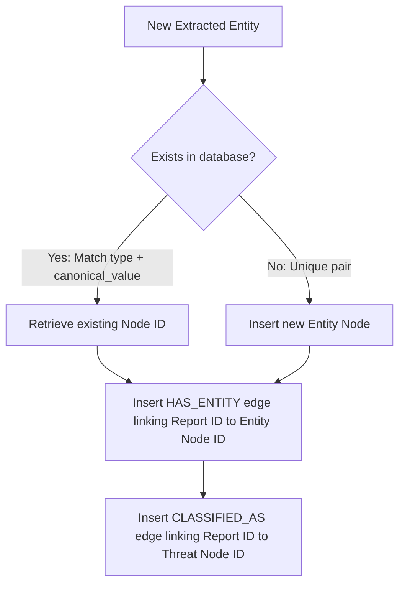

# PRD-301.5 — Knowledge Graph Integration Specification

**Program Codename:** Project Sentinel · **Module:** AI Intelligence Engine & Database (§9.1 - §9.4, §9.7) · **Status:** Implementation-Ready Spec
**Discipline:** Backend Engineering, Database Architecture, QA · **Requirement ID Prefix:** `KG-301.5`

---

## Abstract
This document specifies the technical design, database schemas, deduplication logic, and score propagation rules for the **Knowledge Graph Integration** module of ScamWatch. The module is responsible for persisting the relationships between user Reports, extracted Entities, Threat classifications, and Campaigns in a relational PostgreSQL schema (Volume 10). It details transaction-safe ingestion, noisy-OR confidence propagation with time decay, and retraction cascading.

---

## Table of Contents
1. [Purpose](#1-purpose)
2. [Background](#2-background)
3. [Graph Schema Design](#3-graph-schema-design)
4. [Deduplication & Insertion Rules](#4-deduplication--insertion-rules)
5. [Damped Propagation & Decay Logic](#5-damped-propagation--decay-logic)
6. [Retraction Propagation](#6-retraction-propagation)
7. [Requirements](#7-requirements)
8. [Acceptance Criteria](#8-acceptance-criteria)
9. [Edge Cases & Graph Collisions](#9-edge-cases--graph-collisions)
10. [Security Considerations](#10-security-considerations)
11. [Accessibility Contract](#11-accessibility-contract)
12. [Performance & Transaction Budgets](#12-performance--transaction-budgets)
13. [Future Expansion](#13-future-expansion)

---

## 1. Purpose
The Knowledge Graph Integration module organizes and links isolated fraud incidents into a unified graph. Organising indicators (domains, phones, crypto wallets) as shared nodes enables ScamWatch to map threat networks, verify the reach of scam campaigns, and output structured reasoning for consumer alerts.

---

## 2. Background
At launch, the Knowledge Graph is implemented inside the primary PostgreSQL database (Supabase) using node and edge tables rather than a dedicated graph database. This minimizes operational complexity while maintaining relation-linking capabilities. The challenge lies in:
- **Deduplication**: Ensuring that different reports mentioning the same phone number or URL map to a single unique `Entity` node.
- **Propagation**: Aggregating the threat confidence of multiple reports pointing to the same entity, while accounting for old data decay.

---

## 3. Graph Schema Design

The Postgres-based Knowledge Graph utilizes two main tables: `nodes` and `edges`.

```
                  ┌──────────────────────┐
                  │        NODES         │
                  ├──────────────────────┤
                  │ id (UUID)            │
                  │ type (ENUM)          │
                  │ properties (JSONB)   │
                  │ created_at (TIMESTAMPTZ)
                  └──────────┬───────────┘
                             │ 1
                             │
                             │ 1..*
                  ┌──────────┴───────────┐
                  │        EDGES         │
                  ├──────────────────────┤
                  │ id (UUID)            │
                  │ source_node_id (FK)  │
                  │ target_node_id (FK)  │
                  │ type (ENUM)          │
                  │ properties (JSONB)   │
                  │ created_at (TIMESTAMPTZ)
                  └──────────────────────┘
```

### 3.1. Node Types (`nodes.type` ENUM)
- `Report`: Node representing the raw submission (contains ingest metadata, submission country, and anonymized reporter parameters).
- `Entity`: Node representing an extracted element of fraud infrastructure (phone, URL, email, crypto wallet, brand, payment handle).
- `Threat`: Node representing a specific category in the controlled taxonomy (e.g. Romance, Phishing).
- `Campaign`: Node representing a correlated group of reports/entities sharing infrastructure.

### 3.2. Edge Types (`edges.type` ENUM)
- `HAS_ENTITY` (Report $\to$ Entity)
- `CLASSIFIED_AS` (Report $\to$ Threat)
- `MEMBER_OF_CAMPAIGN` (Report/Entity $\to$ Campaign)
- `IS_LOOKALIKE_OF` (Entity $\to$ Entity; e.g. lookalike domain $\to$ legitimate brand)

---

## 4. Deduplication & Insertion Rules

To prevent duplicate Entity nodes, the insertion process MUST run inside a transaction with conflict resolution:



1. **Deterministic Matching**: Entities are matched against the database using `type` and `canonical_value` (e.g. `phone` + `+15558675309`).
2. **Atomic Resolution**: Insertion uses PostgreSQL `ON CONFLICT` clauses:
   ```sql
   INSERT INTO nodes (type, properties)
   VALUES ('Entity', jsonb_build_object('type', $1, 'canonical_value', $2))
   ON CONFLICT ((properties->>'type'), (properties->>'canonical_value'))
   DO UPDATE SET properties = jsonb_set(properties, '{last_seen_at}', to_jsonb(now()))
   RETURNING id;
   ```

---

## 5. Damped Propagation & Decay Logic

The aggregated fraud score of an Entity node ($P_{\text{fraud}}$) is computed dynamically from its connected reporting edges using a damped **noisy-OR** combination. This ensures that multiple reports increase the fraud confidence asymptotically, but no single report forces it to `1.00`.

### 5.1. Mathematical Formula

$$P_{\text{fraud}}(\text{Entity}) = 1 - \prod_{i=1}^{N} \left(1 - w_{\text{edge}} \cdot C_i \cdot d_i(t)\right)$$

Where:
- $N$ is the number of reports linking to the Entity.
- $w_{\text{edge}}$ is the connection weight (default: `0.90` for direct links, `0.60` for indirect campaign links).
- $C_i$ is the calibrated confidence score of Report $i$.
- $d_i(t)$ is the temporal decay factor.

### 5.2. Temporal Decay Formula
Entities decay over time, representing threat actors rotating their infrastructure:

$$d_i(t) = \exp(-\lambda \cdot t)$$

Where $t$ is the age of the report in days, and $\lambda$ is the decay constant calculated from the half-life $T_{1/2}$:

$$\lambda = \frac{\ln(2)}{T_{1/2}}$$

- **Half-Life Parameters**:
  - URLs / Domains: $T_{1/2} = 30 \text{ days}$ (high rotation).
  - Phone Numbers: $T_{1/2} = 90 \text{ days}$.
  - Crypto Wallets: $T_{1/2} = 180 \text{ days}$ (persistent infrastructure).

---

## 6. Retraction Propagation
When a Report is retracted or deleted (due to moderator action or abuse screening):
1. The `Report` node and all its outgoing edges (`HAS_ENTITY`, `CLASSIFIED_AS`) MUST be flagged as `inactive` (soft deleted).
2. The system MUST trigger an asynchronous recount of the $P_{\text{fraud}}$ score for all connected Entity nodes.
3. If an Entity node's recalculated $P_{\text{fraud}}$ drops below the threshold $\theta_{\text{warning}}$ (`0.65`), any active warnings associated with it MUST be deactivated in the UI.

---

## 7. Requirements

### 7.1. Functional Requirements
- **KG-301.5.1 (MUST)**: Entity insertion MUST use database constraints on `type` and `canonical_value` to ensure uniqueness.
- **KG-301.5.2 (MUST)**: The system MUST calculate $P_{\text{fraud}}$ scores on-the-fly or cache them using materialised views with incremental updates.
- **KG-301.5.3 (MUST)**: All edge creation transactions MUST run under the `SERIALIZABLE` isolation level to prevent race conditions during deduplication.
- **KG-301.5.4 (MUST)**: Deletion of a Report node MUST soft-delete its edges rather than hard-deleting them, preserving historical logs for system audits.

### 7.2. Non-Functional Requirements
- **KG-301.5.5 (MUST)**: The database transaction for creating a report, resolving its entities, and inserting edges MUST complete in under `500ms` p95.
- **KG-301.5.6 (MUST)**: The $P_{\text{fraud}}$ recalculation query for an Entity node with fewer than 50 links MUST execute in under `50ms`.

---

## 8. Acceptance Criteria

- **AC-301.5.a**: Given two separate Reports containing the same phone number `+15558675309`, when ingested, then the database MUST link both `Report` nodes to a single, unique `Entity` node.
- **AC-301.5.b**: Given an Entity linked to three Reports with calibrated confidences of `0.80`, `0.70`, and `0.90` (and no decay), when $P_{\text{fraud}}$ is calculated (with $w_{\text{edge}} = 0.90$), then the resulting score MUST be approximately:
  $$1 - (1 - 0.72) \cdot (1 - 0.63) \cdot (1 - 0.81) \approx 0.98$$
- **AC-301.5.c**: Given a URL Entity whose linking report is 30 days old, when $P_{\text{fraud}}$ is calculated, then its decay factor $d_i(30)$ MUST be exactly `0.50` (complying with its 30-day half-life).
- **AC-301.5.d**: Given a moderator flags a Report as spam/abuse, when processed, then the associated edge connections MUST be deactivated, and the linked entity scores recalculated within 5 seconds.

---

## 9. Edge Cases & Graph Collisions

### 9.1. Shared Public Gateways / Shorteners
- **Edge Case**: Multiple reports list `tinyurl.com` or `bit.ly` as the extracted domain, leading to a massive, false central node.
- **Handling**: The deduplication layer MUST check domains against a whitelist of public URL shorteners. If matched, the system MUST NOT create a shared domain node for the shortener, but MUST parse and link to the final destination URL node instead.

### 9.2. Circular References
- **Edge Case**: A report references a campaign which in turn references the same report.
- **Handling**: All edge insertions MUST enforce directed acyclic graph (DAG) behaviors on campaign structures. Campaign links can only bind `Report` $\to$ `Campaign` or `Entity` $\to$ `Campaign`.

---

## 10. Security Considerations
- **SEC-301.5.1**: RLS policies MUST block read/write operations on the `nodes` and `edges` tables for standard anonymous web users. Only authenticated backend edge functions may execute insertions.
- **SEC-301.5.2**: Any graph analysis queries running over the DB MUST be parameterized to prevent SQL injection payloads from accessing user parameters or clearing relationship logs.

---

## 11. Accessibility Contract
- **A11Y-301.5.1**: Data derived from the graph (such as showing "Shared by 14 other reports") MUST be labeled explicitly for screen readers (e.g. `aria-label="Linked Scam Reports: 14 similar cases"`).

---

## 12. Performance & Transaction Budgets
- **Node deduplication check**: `p50 < 5ms`, `p95 < 25ms`.
- **Edge batch insert transaction**: `p50 < 80ms`, `p95 < 250ms`.
- **Score calculation (noisy-OR)**: `p50 < 10ms`, `p95 < 50ms`.

---

## 13. Future Expansion
1. **Neo4j / Graph-Database Migration**: As the density of relationships grows beyond millions of nodes, the system will migrate from SQL node/edge tables to a native graph database (Neo4j) to support multi-hop path traversal and page-rank algorithms.
2. **Community Detection (Louvain Algorithm)**: Implement unsupervised clustering directly on the graph to detect emerging scam rings by identifying tightly connected subgraphs.
