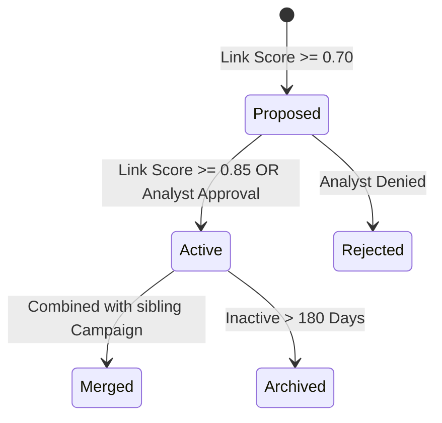

# PRD-301.6 — Campaign Detection Specification

**Program Codename:** Project Sentinel · **Module:** AI Intelligence Engine (§8.5 & §9.5) · **Status:** Implementation-Ready Spec
**Discipline:** AI/ML, Backend Engineering, QA · **Requirement ID Prefix:** `PRD-301.6`

---

## Abstract
This document specifies the technical design, correlation algorithms, lifecycle states, and security boundaries for the **Campaign Detection** engine of ScamWatch. The engine identifies coordinated scam activities by analyzing shared infrastructure, template embedding similarities, and spatial-temporal clustering. It details a rarity-aware entity weighting scheme, a campaign state machine, and defenses against report poisoning and adversarial flooding.

---

## Table of Contents
1. [Purpose](#1-purpose)
2. [Background](#2-background)
3. [Correlation Core Algorithm](#3-correlation-core-algorithm)
4. [Rarity-Aware Entity Weighting](#4-rarity-aware-entity-weighting)
5. [Campaign Lifecycle & State Machine](#5-campaign-lifecycle--state-machine)
6. [Anti-Poisoning & Flood Defenses](#6-anti-poisoning--flood-defenses)
7. [Requirements](#7-requirements)
8. [Acceptance Criteria](#8-acceptance-criteria)
9. [Edge Cases & Cluster Splits](#9-edge-cases--cluster-splits)
10. [Security Considerations](#10-security-considerations)
11. [Accessibility Contract](#11-accessibility-contract)
12. [Performance Budgets](#12-performance-budgets)
13. [Future Expansion](#13-future-expansion)

---

## 1. Purpose
The Campaign Detection engine correlates isolated scam reports into clustered **Campaigns**. Grouping reports enables ScamWatch to track emerging threat actors, warn the public about active localized waves (e.g., Florida utility scam surges), and scale warning impacts by flagging entire infrastructures rather than individual messages.

---

## 2. Background
Threat actors purchase scam kits, hosting layouts, and phone lists, reusing this infrastructure across thousands of targets. While a victim only sees one text, the platform ingests hundreds. 

Simple matching (e.g. grouping by matching phone numbers) is easily bypassed when scammers rotate numbers. Conversely, clustering by raw text similarity results in false positives (e.g., grouping different scams that simply use the word "Urgent"). This spec defines a **multi-signal clustering pipeline** that scores matches using weighted shared entities, vector similarities, and temporal-spatial bursts.

---

## 3. Correlation Core Algorithm

The engine computes a composite correlation score ($S_{\text{link}} \in [0.0, 1.0]$) between a newly ingested Report ($R_{\text{new}}$) and active Campaigns or historical Reports:

$$S_{\text{link}} = w_e \cdot S_{\text{entity}} + w_m \cdot S_{\text{template}} + w_t \cdot S_{\text{temporal}} + w_g \cdot S_{\text{geo}}$$

Where the weight constants sum to $1.0$ (default configuration: $w_e = 0.50$, $w_m = 0.30$, $w_t = 0.15$, $w_g = 0.05$).

### 3.1. Entity Overlap Score ($S_{\text{entity}}$)
Represents the intersection of shared infrastructure nodes, adjusted by their rarity:

$$S_{\text{entity}} = \min\left(1.0, \sum_{e \in E_{\text{shared}}} \text{rarity}(e)\right)$$

### 3.2. Template Similarity ($S_{\text{template}}$)
Represents the cosine similarity of the de-identified text embeddings:

$$S_{\text{template}} = \frac{\vec{E}_{\text{new}} \cdot \vec{E}_i}{\|\vec{E}_{\text{new}}\| \|\vec{E}_i\|}$$

### 3.3. Temporal Proximity ($S_{\text{temporal}}$)
Dampens links between incidents occurring far apart:

$$S_{\text{temporal}} = \exp(-\gamma \cdot \Delta d)$$

Where $\Delta d$ is the age difference in days, and $\gamma = 0.05$ (decaying proximity score by 50% every 14 days).

### 3.4. Geographic Closeness ($S_{\text{geo}}$)
Set to `1.0` if the target counties match (Florida-specific launch parameters), `0.2` if regions differ but stay within the US, and `0.0` otherwise.

---

## 4. Rarity-Aware Entity Weighting
Shared entities do not carry equal evidentiary weight. A shared Gmail domain is common, whereas a shared Bitcoin address is highly specific. The system calculates entity rarity dynamically:

$$\text{rarity}(e) = 1.0 - \min\left(0.95, \frac{\text{degree}(e)}{\text{Total Reports}}\right)$$

Where $\text{degree}(e)$ is the number of Reports linked to Entity $e$ in the Knowledge Graph.

- **High-Entropy Entities** (Base Weight: `1.00`): Crypto wallet addresses, specific lookalike URLs, private email addresses.
- **Medium-Entropy Entities** (Base Weight: `0.50`): Phone numbers, specific brand names.
- **Low-Entropy Entities** (Base Weight: `0.05`): Legitimate domains (e.g. `chase.com` in a phishing lure), public email hosts (`gmail.com`).

---

## 5. Campaign Lifecycle & State Machine

Campaigns transition through a database-backed state machine:

- **Proposed**: Link detected automatically. The campaign is visible to moderators and analysts but hidden from public alerts.
- **Active**: Confirmed campaign. Warnings are generated and pushed to the public UI.
- **Merged**: The campaign has been identified as a subset of another and folded into its node structure.
- **Archived**: No new reports have linked to the campaign for 180 days. Public warning indicators are deactivated.

---

## 6. Anti-Poisoning & Flood Defenses
Adversaries may attempt to flood the platform with fake reports to link legitimate companies to scam campaigns (defamation/denial of service). The system implements the following ingestion guards:
- **IP & Fingerprint Clustering**: Ingestion counts are tracked by IP and device fingerprint. If submissions from a single source exceed 10 reports/hour, the links are capped, and the reports are routed to a manual moderator queue.
- **Min Hash Diversity**: Before merging reports into a campaign, the system verifies that the reports originate from at least three distinct submitter accounts/sources, preventing single-user campaign generation.

---

## 7. Requirements

### 7.1. Functional Requirements
- **PRD-301.6.1 (MUST)**: Campaign detection MUST use rarity-weighted entity matching to prevent low-entropy nodes (like Gmail domains) from triggering false merges.
- **PRD-301.6.2 (MUST)**: If a shared entity is a cryptocurrency wallet, the system MUST automatically propose a campaign link, bypassing template similarity thresholds (`AC-301.6.a`).
- **PRD-301.6.3 (MUST)**: Any campaign transition to the `Active` state that triggers public alerts MUST be recorded in the audit logs with the associated link score.
- **PRD-301.6.4 (MUST NOT)**: The engine MUST NOT link reports if the composite correlation score $S_{\text{link}}$ falls below `0.70`.

### 7.2. Non-Functional Requirements
- **PRD-301.6.5 (MUST)**: The campaign clustering pipeline (triggered asynchronously after ingestion) MUST complete execution within `10 seconds` of report finalization.
- **PRD-301.6.6 (MUST)**: The correlation query MUST utilize a pre-calculated entity-degree cache to avoid execution timeouts on high-frequency tables.

---

## 8. Acceptance Criteria

- **AC-301.6.a**: Given two reports sharing the same Bitcoin wallet address, when processed, then the system MUST create a `Proposed` campaign link, even if the report texts have different template formats.
- **AC-301.6.b**: Given two reports sharing only the domain `gmail.com`, when correlated, then the domain's low-entropy weight (`0.05`) MUST NOT trigger a campaign link.
- **AC-301.6.c**: Given a campaign with no new report linkages for 180 days, when the scheduled daily maintenance job runs, then the campaign status MUST transition to `Archived`.
- **AC-301.6.d**: Given an attacker submits 50 reports within 10 minutes containing a target's legitimate business phone number, when analyzed, then the system's rate limiter MUST quarantine the reports and block campaign proposing.

---

## 9. Edge Cases & Cluster Splits

### 9.1. Unified Kits with Distinct Infrastructure
- **Edge Case**: Scammers deploy identical text messages but use different phone numbers and URLs.
- **Handling**: The template similarity component ($S_{\text{template}}$) will score high (approx `0.90`). If the combined score $S_{\text{link}}$ crosses `0.75` (due to text overlap), the system MUST propose a campaign link, documenting that the relationship is driven by template similarity rather than shared infrastructure.

### 9.2. Broad Impersonation Campaigns
- **Edge Case**: A campaign targeting IRS impersonation accumulates thousands of reports, making the graph node too large to process.
- **Handling**: Large campaigns MUST be segmented into sub-campaigns based on regional temporal bursts (e.g. `IRS-Impersonation-FL-2026-Q2`), linked to a parent campaign node to preserve hierarchy.

---

## 10. Security Considerations
- **SEC-301.6.1**: Modifying a campaign's status to `Active` can trigger public warning indicators. The Supabase schema MUST enforce role-based access control, allowing only `analyst`, `moderator`, and `admin` roles to override campaign states.
- **SEC-301.6.2**: All cluster queries must be isolated inside the backend queue worker, avoiding expose of raw clustering coordinates or target similarity vectors to public API endpoints.

---

## 11. Accessibility Contract
- **A11Y-301.6.1**: Public campaign alerts MUST provide plain language summaries of the linked infrastructure (e.g. `"This alert combines 14 reports sharing 2 web addresses"`), ensuring readability for screen readers.

---

## 12. Performance Budgets
- **Embedding similarity check**: `p50 < 30ms`, `p95 < 120ms` (using HNSW index).
- **Rarity weight resolution**: `p50 < 5ms`, `p95 < 20ms`.
- **Lifecycle state transition**: `p50 < 15ms`, `p95 < 50ms`.

---

## 13. Future Expansion
1. **Dynamic Handoff to Takedown Providers**: Future expansion will implement webhooks that automatically send verified `Active` campaign infrastructure (URLs/domains) to registrar abuse teams and hosting providers for takedown processing.
2. **Unsupervised Graph Neural Networks (GNN)**: Deploy a GNN (e.g., GraphSAGE) to learn representation vectors for campaign nodes, enabling classification of new reports based on complex topological structural similarity.
