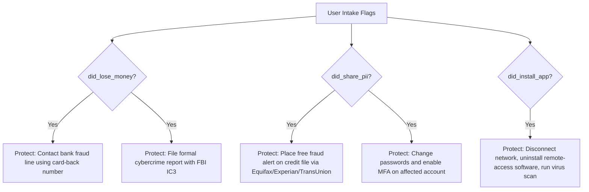

# PRD-301.7 — Recommendation Engine Specification

**Program Codename:** Project Sentinel · **Module:** AI Intelligence Engine (§8.6) · **Status:** Implementation-Ready Spec
**Discipline:** Backend Engineering, UX Design, Product, QA · **Requirement ID Prefix:** `RE-301.7`

---

## Abstract
This document specifies the technical design, routing configurations, execution logic, and presentation contracts for the **Recommendation Engine** of ScamWatch. The engine is responsible for generating personalized, context-aware next steps for users who submit reports. It partitions recommendations into three standardized buckets (Understand, Verify, Protect), maps classifications to official agencies via a strict URL allowlist, and configures conditional protective actions depending on financial or identity exposures.

---

## Table of Contents
1. [Purpose](#1-purpose)
2. [Background](#2-background)
3. [The Three-Bucket Model](#3-the-three-bucket-model)
4. [Verification Routing Table](#4-verification-routing-table)
5. [Conditional Action Logic (Protect)](#5-conditional-action-logic-protect)
6. [Anti-Recovery Scam Protections](#6-anti-recovery-scam-protections)
7. [Requirements](#7-requirements)
8. [Acceptance Criteria](#8-acceptance-criteria)
9. [Edge Cases & Fallbacks](#9-edge-cases--fallbacks)
10. [Security Considerations](#10-security-considerations)
11. [Accessibility Contract](#11-accessibility-contract)
12. [Performance & Latency Budgets](#12-performance--latency-budgets)
13. [Future Expansion](#13-future-expansion)

---

## 1. Purpose
The Recommendation Engine guides victims toward safe recovery actions immediately after they encounter a scam. It translates automated classification data into structured steps that prevent further harm, connects users to verified reporting agencies, and increases public literacy.

---

## 2. Background
Scam victims are vulnerable to follow-up fraud, particularly "recovery scams" (where fake agents promise to recover lost funds for an upfront fee). When panic sets in, generic advice (e.g. "be careful online") is ineffective. 

To operationalize the core product principle **"Always route to official verification"**, the platform requires a deterministic, rule-based recommendation pipeline. This pipeline generates clear instructions, links only to vetted public agencies, and displays prominent disclaimers stating that the information provided is for consumer protection, not legal advice.

---

## 3. The Three-Bucket Model

The Recommendation Engine MUST organize all outputs into three distinct schema-valid blocks:

```
[Threat Verdict + Submitter Context]
                  │
                  ▼
┌────────────────────────────────────────┐
│         RECOMMENDATION ENGINE          │
├────────────────────────────────────────┤
│ 1. Understand (Related educational)    │
│ 2. Verify (Official reporting URLs)   │
│ 3. Protect (Urgent corrective steps)   │
└────────────────────────────────────────┘
```

1. **Understand (Education)**: Pointers to related threat signatures, educational summaries, and campaign notes (e.g., explaining how utility smishing kits operate).
2. **Verify (Reporting & Handoff)**: Direct, verified links to official regulatory agencies where the user can submit official complaints or check credentials.
3. **Protect (Mitigation)**: A checklist of immediate, concrete steps the user should take (e.g., locking credit reports, calling a bank's official number).

---

## 4. Verification Routing Table
The engine maps taxonomy classifications to official agencies using a configuration routing table. The URLs in this table are static and verified at deployment:

| Threat Category | Primary Federal Agency | Launch State Agency (Florida) | Verified URL |
| :--- | :--- | :--- | :--- |
| **Phishing / Smishing** | FTC | Florida Attorney General | `https://reportfraud.ftc.gov` |
| **Impersonation (Gov't)** | FTC + Impersonated Org | Florida AG | `https://www.oig.ssa.gov` (if SSA) |
| **Investment / Crypto** | SEC + CFTC | Florida Office of Financial Regulation | `https://www.sec.gov/tcr` |
| **Tech Support** | FTC | Florida AG | `https://reportfraud.ftc.gov` |
| **Romance Scams** | FBI IC3 | Florida AG | `https://www.ic3.gov` |
| **Tax Impersonation** | Treasury IG (TIGTA) | Florida Department of Revenue | `https://www.tigta.gov` |

---

## 5. Conditional Action Logic (Protect)
The engine evaluates the user's submitter context (submitted via checkboxes during intake) to generate conditional mitigation steps:



---

## 6. Anti-Recovery Scam Protections
- **Vetted Link Policy**: Under no circumstances should the engine suggest, link to, or display third-party "scam recovery specialists," "crypto recovery bounty hunters," or private investigation firms. These are flagged platform-wide as recovery fraud vectors.
- **Link Auditing**: All outbound links in the `Verify` bucket must match a regex allowlist of government domains (`.gov`, `.mil`) or verified official bank domains.

---

## 7. Requirements

### 7.1. Functional Requirements
- **RE-301.7.1 (MUST)**: Recommendations MUST contain the canonical legal disclaimer: `"This is consumer protection information, not legal advice. Always verify with the official organizations listed."`
- **RE-301.7.2 (MUST)**: Verify links for Florida-based users MUST prioritize Florida state agencies alongside federal options.
- **RE-301.7.3 (MUST)**: If `did_lose_money` is true, the Protect checklist MUST flag the bank-contact step with `urgency = "high"` and place it at the top of the user's checklist.
- **RE-301.7.4 (MUST NOT)**: Outbound links in recommendations MUST NOT open automatically; they MUST require an explicit user click, and the UI MUST display the full URL destination.

### 7.2. Non-Functional Requirements
- **RE-301.7.5 (MUST)**: The recommendation assembly query (combining the routing table lookup and context filter) MUST complete execution in under `500ms` p95.

---

## 8. Acceptance Criteria

- **AC-301.7.a**: Given a classification of `Impersonation (gov't)` for a Florida user, when recommendations generate, then the `Verify` list MUST contain `https://reportfraud.ftc.gov` and the Florida Attorney General's portal.
- **AC-301.7.b**: Given `did_share_pii = true` on a report, when recommendations generate, then the `Protect` checklist MUST include the specific instruction to place credit fraud alerts, linking directly to the official bureaus (Equifax, Experian, TransUnion).
- **AC-301.7.c**: Given a completed recommendation payload, when rendered, then the engine MUST verify that no unofficial recovery links exist and the standard disclaimer is appended.
- **AC-301.7.d**: Given an `abstained` (unknown) classification, when recommendations generate, then the system MUST output a generic "Safety Checklist" containing basic bank and credit freeze steps.

---

## 9. Edge Cases & Fallbacks

### 9.1. Multiple Classifications with Conflicting Advice
- **Edge Case**: A report is flagged as both Romance and Investment/Crypto.
- **Handling**: The system MUST combine the reporting entities (FBI IC3 and SEC), remove duplicates, and prioritize the PII/financial recovery checklist (bank contact + credit freeze) in the Protect bucket.

### 9.2. Out-of-State Submissions (Phase 2 / Phase 3)
- **Edge Case**: The user's zip code resolves to Georgia (outside the Florida launch zone).
- **Handling**: The engine MUST filter out Florida AG links and replace them with Georgia Attorney General contacts, falling back to Federal entities (`.gov`) if the specific state routing entry is absent.

---

## 10. Security Considerations
- **SEC-301.7.1**: The routing allowlist table MUST be write-protected. Only migration scripts executed by database administrators may alter the official URLs, mitigating database tampering risks.
- **SEC-301.7.2**: Outbound links rendered in the React interface MUST enforce security attributes (`rel="noopener noreferrer" target="_blank"`) to prevent reverse tabnabbing vulnerabilities.

---

## 11. Accessibility Contract
- **A11Y-301.7.1**: Each recommendation checkbox item MUST be accessible via screen reader, with the `urgency` value announced textually (e.g. `"[High Urgency] Step 1: Call your bank."`).
- **A11Y-301.7.2**: Verify links MUST use descriptive link text indicating the specific agency name rather than ambiguous text like "Click here".

---

## 12. Performance & Latency Budgets
- **Routing Table Resolution**: `p50 < 5ms`, `p95 < 20ms`.
- **Context Evaluation**: `p50 < 2ms`, `p95 < 10ms`.
- **Total Assembly Pipeline**: `p50 < 50ms`, `p95 < 500ms`.

---

## 13. Future Expansion
1. **Direct API Reporting (Warm Handoff)**: Future versions will establish direct API integrations with agencies like the FTC. This will allow ScamWatch to automatically pre-fill federal complaint forms with the user's consent, bypassing manual copy-pasting.
2. **Interactive Checklist Progress Tracker**: Allow users to create an anonymous session to check off completed recovery actions, sending notifications for follow-up steps (e.g., checking credit reports after 30 days).
