# Volume 10 — Database

> ScamWatch (Project Sentinel). Authored against `_shared-context.md`. Do not contradict shared decisions.

This volume defines the authoritative PostgreSQL (Supabase) data model for ScamWatch: the entity-relationship overview, every table with columns/types/constraints/keys/indexes, Row-Level Security (RLS) policies per role, retention and purge schedules, soft- vs hard-delete and retraction-propagation strategy, PII classification and encryption-at-rest notes, and the migration strategy. Table and column names defined here are canonical and are referenced verbatim by Volume 11 — API Specification and Volume 13 — Backend Architecture. All requirements are tagged `DB-10.<section>.<n>`.

## Table of Contents

1. ER Overview
2. Conventions & Shared Types
3. Identity: `users`, `profiles`, `roles`, `user_roles`
4. Reports & Media: `reports`, `report_media`
5. Entities & Join: `entities`, `report_entities`
6. Threats & Join: `threats`, `report_threats`
7. Campaigns: `campaigns`, `campaign_entities`, `campaign_reports`
8. Verifications & Official Orgs: `verifications`, `official_orgs`
9. Explanations & Scores: `explanations`, `scores`
10. Moderation & Audit: `moderation_actions`, `audit_log`
11. Notifications & Alerts: `notifications`, `alert_subscriptions`
12. Reputation & Contributions: `reputation`, `contributions`
13. Embeddings (pgvector): `embeddings`
14. Lookups: enums & lookup tables
15. Indexing Strategy (search/GIN, pgvector ivfflat/hnsw, partial)
16. Row-Level Security (per role)
17. Data Retention & Purge Schedule
18. Soft-Delete, Hard-Delete & Retraction Propagation
19. PII Classification & Encryption-at-Rest
20. Migration Strategy

---

## 1. ER Overview

### Purpose
Give engineers a single mental model of how the canonical domain objects (Report, Entity, Threat, Campaign, Verification, Explanation, Confidence) map onto relational tables before they read the column-level detail.

### Background
The knowledge graph is modeled in PostgreSQL (nodes + edges via the `entities` / `report_entities` / `campaign_entities` join tables) rather than a dedicated graph DB at launch (shared context §Engineering Stack). Vector search uses `pgvector`. All tables live in schema `public` unless noted; Supabase Auth owns `auth.users` and we mirror minimal profile data into `public.profiles`.

### ER diagram (text / mermaid-style)

```mermaid
erDiagram
    auth_users ||--|| profiles : "1:1 (auth.users.id = profiles.id)"
    profiles ||--o{ user_roles : has
    roles ||--o{ user_roles : grants
    profiles ||--o{ reports : submits
    reports ||--o{ report_media : contains
    reports ||--o{ report_entities : references
    entities ||--o{ report_entities : referenced_by
    reports ||--o{ report_threats : classified_as
    threats ||--o{ report_threats : classifies
    campaigns ||--o{ campaign_reports : groups
    reports ||--o{ campaign_reports : member_of
    campaigns ||--o{ campaign_entities : groups
    entities ||--o{ campaign_entities : member_of
    reports ||--o{ explanations : explained_by
    threats ||--o{ explanations : explained_by
    entities ||--o{ explanations : explained_by
    campaigns ||--o{ explanations : explained_by
    entities ||--o{ scores : scored
    threats ||--o{ scores : scored
    report_entities ||--o{ scores : scored
    campaign_entities ||--o{ scores : scored
    official_orgs ||--o{ verifications : target_of
    reports ||--o{ verifications : suggests
    threats ||--o{ verifications : suggests
    reports ||--o{ moderation_actions : moderated
    entities ||--o{ moderation_actions : moderated
    profiles ||--o{ moderation_actions : performed_by
    profiles ||--o{ notifications : receives
    profiles ||--o{ alert_subscriptions : owns
    campaigns ||--o{ notifications : triggers
    profiles ||--|| reputation : has
    profiles ||--o{ contributions : earns
    reports ||--o{ embeddings : vectorized
    entities ||--o{ embeddings : vectorized
    threats ||--o{ embeddings : vectorized
    profiles ||--o{ audit_log : actor
```



### Cardinality summary

| Relationship | Type | Notes |
|---|---|---|
| `profiles` → `reports` | 1:N | `reports.reporter_id` nullable for anonymous submissions |
| `reports` ↔ `entities` | M:N via `report_entities` | each link carries its own `confidence` |
| `reports` ↔ `threats` | M:N via `report_threats` | classification confidence per link |
| `campaigns` ↔ `reports` / `entities` | M:N | correlation membership |
| `*` → `explanations` | polymorphic 1:N | `subject_type` + `subject_id` |
| `*` → `embeddings` | polymorphic 1:N | `owner_type` + `owner_id` |

### Requirements
- `DB-10.1.1` The schema **MUST** model the knowledge graph in PostgreSQL using `entities` (nodes) and the `report_entities` / `campaign_entities` join tables (edges); a dedicated graph database **MUST NOT** be introduced at launch.
- `DB-10.1.2` Every M:N relationship between domain objects **MUST** be a first-class join table that can itself carry a `confidence` column where a calibrated link strength is meaningful.
- `DB-10.1.3` Polymorphic associations (`explanations`, `embeddings`, `scores`, `moderation_actions`) **MUST** use a `(subject_type, subject_id)` / `(owner_type, owner_id)` pair where `*_type` is a constrained enum, and **MUST NOT** use cross-table foreign keys that the database cannot enforce silently; integrity **MUST** be enforced by trigger or application-layer checks documented per table.
- `DB-10.1.4` Primary keys **SHOULD** be `uuid` generated by `gen_random_uuid()` for all user-facing entities; lookup tables **MAY** use stable text codes as PKs.

### Acceptance Criteria
- AC: Given the migration set is applied to an empty Supabase project, when `\dt public.*` is run, then all tables in this volume exist with the documented PKs/FKs.
- AC: Given a Report linked to two Entities, when the graph is traversed via `report_entities`, then both edges expose a per-link `confidence`.

### Edge Cases
- An anonymous Report has `reporter_id IS NULL`; all FKs from such a report must still resolve.
- An Entity may exist with zero Reports (e.g. imported from an official feed) — orphan entities are valid.

### Security Considerations
Polymorphic columns are a SQL-injection-free design only if `*_type` values are validated against the enum at write time (DB-10.1.3). RLS (§16) is the primary control surface; FKs are not a substitute for RLS.

### Accessibility
N/A (data layer; no user-facing surface). Operational note: schema comments (`COMMENT ON`) must document PII columns so downstream a11y/PII tooling can introspect.

### Performance
The graph-in-Postgres choice trades graph-native traversal speed for operational simplicity. Campaign correlation queries (§7) are bounded to 2–3 hops; deeper traversal is a Future Expansion item (DB-10.20.4).

### Future Expansion
- Optional migration to a property-graph extension (`pg_graphql`/Apache AGE) or external graph DB if multi-hop campaign queries exceed latency budgets.

---

## 2. Conventions & Shared Types

### Purpose
Define reusable conventions so every table is consistent.

### Requirements
- `DB-10.2.1` All tables **MUST** include `id uuid PRIMARY KEY DEFAULT gen_random_uuid()` unless a lookup table with a natural code PK.
- `DB-10.2.2` All tables **MUST** include `created_at timestamptz NOT NULL DEFAULT now()`; mutable tables **MUST** include `updated_at timestamptz NOT NULL DEFAULT now()` maintained by a shared `set_updated_at()` trigger.
- `DB-10.2.3` Soft-deletable tables **MUST** include `deleted_at timestamptz NULL` and `deleted_by uuid NULL REFERENCES profiles(id)`.
- `DB-10.2.4` Money is not stored; loss figures **MUST** use `numeric(14,2)` and a `currency char(3)` (ISO 4217) where reported.
- `DB-10.2.5` All `confidence` columns **MUST** be `numeric(4,3)` constrained `CHECK (confidence >= 0 AND confidence <= 1)` to encode the calibrated 0–1 Confidence object.
- `DB-10.2.6` Free-text user content columns **MUST** be `text` (never `varchar(n)` size guesses) and length-bounded by `CHECK` only where a product limit exists.

```sql
-- Shared trigger function (used by every mutable table)
create or replace function public.set_updated_at()
returns trigger language plpgsql as $$
begin
  new.updated_at = now();
  return new;
end $$;
```

### Acceptance Criteria
- AC: Every mutable table has a `BEFORE UPDATE` trigger calling `set_updated_at()`.

### Edge Cases / Security / Accessibility / Performance / Future Expansion
- Edge: clock skew on `now()` is acceptable; ordering relies on `id` ULID-style tiebreak only where documented.
- Security: triggers run as table owner; ensure `SECURITY DEFINER` is **not** used on `set_updated_at()` (it does not need elevated rights).
- A11y: N/A. Performance: trigger overhead is negligible. Future: adopt `ulid` PKs if time-ordering of inserts becomes a hot path.

---

## 3. Identity — `users`, `profiles`, `roles`, `user_roles`

### Purpose
Bridge Supabase Auth (`auth.users`) to application profile data and implement the six-role model: `anonymous`, `member`, `contributor`, `moderator`, `analyst`, `admin`.

### Background
Supabase Auth owns credentials/sessions in `auth.users`. We never duplicate credentials. `anonymous` is **not** a stored role row — it is the absence of an authenticated JWT; it is enumerated for RLS clarity only. A user may hold multiple roles (`user_roles` is M:N), and effective privilege is the highest grant.

### Schema

```sql
-- 1:1 mirror of auth.users; created by a trigger on auth.users insert
create table public.profiles (
  id            uuid primary key references auth.users(id) on delete cascade,
  display_name  text,
  -- PII (see §19): email is mastered in auth.users; we keep only a hash for dedupe
  email_hash    bytea,                       -- sha256(lower(email)); never raw email
  locale        text not null default 'en-US',
  region_code   text,                        -- e.g. 'US-FL' for local-alert targeting
  is_suspended  boolean not null default false,
  created_at    timestamptz not null default now(),
  updated_at    timestamptz not null default now(),
  deleted_at    timestamptz null,
  deleted_by    uuid null references public.profiles(id)
);

create table public.roles (
  code        text primary key,              -- 'member','contributor','moderator','analyst','admin'
  description text not null,
  rank        smallint not null              -- for "highest grant wins"
);

create table public.user_roles (
  user_id    uuid not null references public.profiles(id) on delete cascade,
  role_code  text not null references public.roles(code),
  granted_by uuid null references public.profiles(id),
  granted_at timestamptz not null default now(),
  primary key (user_id, role_code)
);

create index idx_user_roles_role on public.user_roles(role_code);
```

```sql
-- Seed roles
insert into public.roles(code, description, rank) values
 ('member','Authenticated consumer',10),
 ('contributor','Trusted reporter',20),
 ('moderator','Reviews reports & handles takedowns/appeals',30),
 ('analyst','Campaign analysis & classification review',40),
 ('admin','Full administrative control',50);
```

```sql
-- Helper used throughout RLS: highest-rank role for the current JWT
create or replace function public.current_role_rank()
returns smallint language sql stable as $$
  select coalesce(max(r.rank), 0)
  from public.user_roles ur
  join public.roles r on r.code = ur.role_code
  where ur.user_id = auth.uid();
$$;
```

### Requirements
- `DB-10.3.1` `profiles.id` **MUST** equal `auth.users.id` and be created by a `SECURITY DEFINER` trigger on `auth.users` insert.
- `DB-10.3.2` Raw email **MUST NOT** be stored in `public.profiles`; only `email_hash` (sha256 of lowercased email) **MAY** be stored for de-duplication and abuse correlation.
- `DB-10.3.3` Role checks in RLS **MUST** use `current_role_rank()` (highest grant wins).
- `DB-10.3.4` Deleting a `profiles` row **MUST** cascade to owned personal rows only per the retraction policy (§18), not to community-value rows (reports stay, re-attributed to a tombstone).

### Acceptance Criteria
- AC: Given a new sign-up, when `auth.users` row is created, then a matching `profiles` row exists within the same transaction.
- AC: Given a user with `member`+`analyst`, when `current_role_rank()` is evaluated, then it returns `40`.

### Edge Cases
- Race: profile-creation trigger must be idempotent (`on conflict (id) do nothing`).
- A suspended user (`is_suspended=true`) keeps rows but is blocked at RLS write policies.

### Security Considerations
`email_hash` is keyed-hash-optional; if abuse-graphing across emails is needed, use HMAC with a server secret (see Volume 13 — Backend Architecture, secrets management) rather than plain sha256 to resist rainbow tables.

### Accessibility
N/A at data layer; `locale`/`region_code` feed accessible localized copy upstream.

### Performance
`current_role_rank()` is `STABLE` and hits a tiny per-user index — safe to call inside RLS predicates.

### Future Expansion
- Org/team accounts → a `teams` table + `team_members`; deferred.

---

## 4. Reports & Media — `reports`, `report_media`

### Purpose
Store user-submitted scam encounters (the **Report**) and their attached screenshots/files (the **report_media**).

### Background
Reports are the primary write path. Submission must be idempotent (Volume 11 — API Specification, idempotency). Anonymous reports are permitted (`reporter_id NULL`) per Product Principle "keep core education free / minimize collection". Raw uploaded files live in Supabase Storage; `report_media` holds metadata + the storage path, never the bytes.

### Schema

```sql
create type report_channel as enum ('sms','email','phone','web','social','marketplace','in_person','other');
create type report_status  as enum ('submitted','triaging','processing','published','rejected','retracted','duplicate');

create table public.reports (
  id              uuid primary key default gen_random_uuid(),
  reporter_id     uuid null references public.profiles(id) on delete set null,  -- NULL = anonymous
  idempotency_key uuid null,                  -- de-dupes client retries (see §unique idx)
  channel         report_channel not null,
  raw_text        text,                       -- PII-bearing (see §19); de-identified copy in narrative
  narrative       text,                       -- moderated/redacted display text
  reported_region text,                       -- 'US-FL' etc., for local-campaign alerts
  loss_amount     numeric(14,2),
  currency        char(3),
  occurred_at     timestamptz,
  status          report_status not null default 'submitted',
  is_sensitive    boolean not null default false, -- sextortion/abuse → extra access limits
  language        text,                        -- detected ISO 639-1
  created_at      timestamptz not null default now(),
  updated_at      timestamptz not null default now(),
  deleted_at      timestamptz null,
  deleted_by      uuid null references public.profiles(id),
  check (loss_amount is null or loss_amount >= 0)
);

create unique index uq_reports_idem
  on public.reports(reporter_id, idempotency_key)
  where idempotency_key is not null;

create index idx_reports_status        on public.reports(status) where deleted_at is null;
create index idx_reports_region        on public.reports(reported_region) where deleted_at is null;
create index idx_reports_reporter      on public.reports(reporter_id);
create index idx_reports_created_brin  on public.reports using brin (created_at);

create type media_kind as enum ('image','pdf','audio','video','other');
create type scan_status as enum ('pending','clean','infected','quarantined','failed');

create table public.report_media (
  id            uuid primary key default gen_random_uuid(),
  report_id     uuid not null references public.reports(id) on delete cascade,
  storage_path  text not null,               -- bucket-relative key in 'report-media'
  kind          media_kind not null,
  byte_size     bigint not null check (byte_size > 0),
  sha256        bytea not null,              -- content hash for dedupe + tamper-evidence
  scan_status   scan_status not null default 'pending',
  exif_stripped boolean not null default false,
  ocr_text      text,                        -- populated by async OCR (Volume 8 / Volume 13)
  width         int, height int,
  created_at    timestamptz not null default now(),
  deleted_at    timestamptz null
);

create index idx_media_report on public.report_media(report_id);
create unique index uq_media_sha on public.report_media(report_id, sha256);
create index idx_media_scan on public.report_media(scan_status) where scan_status <> 'clean';
```

### Requirements
- `DB-10.4.1` A Report **MUST** be insertable with `reporter_id IS NULL` (anonymous tier).
- `DB-10.4.2` Idempotent submission **MUST** be enforced by `uq_reports_idem`; a retry with the same `(reporter_id, idempotency_key)` **MUST** be rejected at the DB and surfaced as the original resource by the API (Volume 11 — API Specification).
- `DB-10.4.3` `report_media.storage_path` **MUST** reference the `report-media` Storage bucket; bytes **MUST NOT** be stored in Postgres.
- `DB-10.4.4` Media **MUST NOT** be served until `scan_status = 'clean'` AND `exif_stripped = true` (enforced at API + Storage policy; see Volume 13 — Backend Architecture).
- `DB-10.4.5` `raw_text` is PII-bearing and **MUST** follow the retention/purge schedule (§17) independently of the de-identified `narrative`.

### Acceptance Criteria
- AC: Given two inserts with identical `(reporter_id, idempotency_key)`, when the second runs, then it raises `unique_violation` and no second report row exists.
- AC: Given media with `scan_status='infected'`, when a signed URL is requested, then the API returns 409/blocked (Volume 11).

### Edge Cases
- Anonymous + idempotency: when `reporter_id IS NULL`, the partial unique index does not de-dupe across anonymous clients; the API supplements with a server-computed content hash (documented in Volume 11).
- A media file shared verbatim across many reports yields distinct `report_media` rows (per-report ownership) but a shared `sha256` enables cross-report correlation.

### Security Considerations
`raw_text` and original uploads can contain victim PII and attacker payloads (malicious URLs). The `narrative` column is the only field eligible for public/anonymous reads (§16). Scanning + EXIF stripping happen before `scan_status='clean'`.

### Accessibility
N/A at data layer. `ocr_text` later powers alt-text and screen-reader summaries of screenshots (a positive a11y enabler).

### Performance
BRIN index on `created_at` keeps the hot insert path cheap while supporting time-range scans; status/region B-trees are partial (exclude soft-deleted).

### Future Expansion
- Per-media content moderation labels (NSFW/abuse) as a structured column once the classifier (Volume 8) emits them.

---

## 5. Entities & Join — `entities`, `report_entities`

### Purpose
Store extracted fraud-infrastructure atoms (the **Entity**: phone, URL/domain, email, crypto wallet, sender name, impersonated brand, payment handle) and link them to Reports with per-link confidence (graph edges).

### Schema

```sql
create type entity_type as enum (
  'phone','url','domain','email','crypto_wallet','payment_handle',
  'sender_name','brand_impersonated','bank_account','social_handle','app_name','other'
);

create table public.entities (
  id              uuid primary key default gen_random_uuid(),
  type            entity_type not null,
  value_raw       text not null,             -- as-seen
  value_norm      text not null,             -- normalized (E.164 phone, lowercased host, etc.)
  first_seen_at   timestamptz not null default now(),
  last_seen_at    timestamptz not null default now(),
  report_count    int not null default 0,    -- denormalized; maintained by trigger
  is_official     boolean not null default false, -- legitimate org infra (allow-list)
  notes           text,
  created_at      timestamptz not null default now(),
  updated_at      timestamptz not null default now(),
  deleted_at      timestamptz null,
  deleted_by      uuid null references public.profiles(id)
);

create unique index uq_entities_type_norm on public.entities(type, value_norm) where deleted_at is null;
create index idx_entities_value_trgm on public.entities using gin (value_norm gin_trgm_ops);
create index idx_entities_lastseen on public.entities(last_seen_at) where deleted_at is null;

create table public.report_entities (
  report_id   uuid not null references public.reports(id) on delete cascade,
  entity_id   uuid not null references public.entities(id) on delete cascade,
  role        text,                          -- 'sender','payment_target','link','callback', etc.
  confidence  numeric(4,3) not null default 1.000 check (confidence between 0 and 1),
  extracted_by text not null default 'ai',   -- 'ai' | 'human' | 'feed'
  created_at  timestamptz not null default now(),
  primary key (report_id, entity_id, coalesce(role,''))
);

create index idx_re_entity on public.report_entities(entity_id);
```

### Requirements
- `DB-10.5.1` Entities **MUST** be de-duplicated on `(type, value_norm)`; extraction **MUST** upsert against `uq_entities_type_norm`.
- `DB-10.5.2` `value_norm` **MUST** be produced by type-specific normalization (E.164, IDNA/punycode host lowercasing, checksum-validated wallet) before insert.
- `DB-10.5.3` `entities.report_count`, `first_seen_at`, `last_seen_at` **MUST** be maintained by trigger on `report_entities` insert/delete.
- `DB-10.5.4` Entities on the official allow-list (`is_official=true`) **MUST NOT** be surfaced as threats and **MUST** suppress threat classification downstream (Volume 8 / Volume 11).

### Acceptance Criteria
- AC: Given the same phone reported twice in different formats, when both are normalized to one E.164 value, then exactly one `entities` row exists and `report_count = 2`.
- AC: Given trigram search for a partial domain, when `idx_entities_value_trgm` is used, then results return without a full scan.

### Edge Cases
- Homograph/punycode domains: normalize to punycode; keep `value_raw` for display with a Unicode-confusable warning.
- Shared infrastructure (a URL shortener) may be high-frequency but legitimate → `is_official` allow-list prevents over-flagging.

### Security Considerations
`value_raw` may contain live malicious URLs — never auto-link in any rendered surface; the API returns them defanged (Volume 11 error/abuse section).

### Accessibility
N/A. Defanged rendering also benefits screen-reader users (no accidental link activation).

### Performance
GIN trigram index supports substring/fuzzy entity search; the unique normalized index keeps upserts O(log n).

### Future Expansion
- Entity reputation feeds (PhishTank/abuse.ch) imported as `extracted_by='feed'` edges; deferred.

---

## 6. Threats & Join — `threats`, `report_threats`

### Purpose
Store classified scam patterns (the **Threat**, e.g. "Toll-road smishing") and link Reports to Threats with calibrated classification confidence.

### Background
Threat rows are curated against the shared threat taxonomy. `report_threats` carries the AI **Confidence** per classification.

### Schema

```sql
create table public.threats (
  id           uuid primary key default gen_random_uuid(),
  slug         text not null unique,         -- 'toll-road-smishing'
  name         text not null,
  category     text not null references public.threat_categories(code),
  summary      text not null,                -- calibrated, victim-respecting
  indicators   jsonb not null default '[]',  -- structured tells
  is_active    boolean not null default true,
  created_at   timestamptz not null default now(),
  updated_at   timestamptz not null default now()
);

create index idx_threats_category on public.threats(category);
create index idx_threats_indicators_gin on public.threats using gin (indicators jsonb_path_ops);

create table public.report_threats (
  report_id   uuid not null references public.reports(id) on delete cascade,
  threat_id   uuid not null references public.threats(id) on delete restrict,
  confidence  numeric(4,3) not null check (confidence between 0 and 1),
  classified_by text not null default 'ai',  -- 'ai' | 'human'
  model_version text,                        -- audit which model produced it
  created_at  timestamptz not null default now(),
  primary key (report_id, threat_id)
);

create index idx_rt_threat on public.report_threats(threat_id);
create index idx_rt_conf on public.report_threats(confidence);
```

### Requirements
- `DB-10.6.1` Each `report_threats` row **MUST** carry a `confidence` (0–1) and **SHOULD** carry `model_version` for auditability.
- `DB-10.6.2` `threats.category` **MUST** reference the `threat_categories` lookup (§14) seeded from the shared taxonomy.
- `DB-10.6.3` Deleting a `threats` row **MUST** be restricted (`on delete restrict`) while `report_threats` reference it; deprecate via `is_active=false` instead.

### Acceptance Criteria
- AC: Given a report classified as two threats, when fetched, then both links expose distinct confidences and model versions.

### Edge Cases / Security / Accessibility / Performance / Future Expansion
- Edge: a report may match zero threats (legitimate/unclear) — absence is valid and surfaced as "insufficient signal" in Explanations.
- Security: classification text is never stated as fact; the API always attaches confidence + verify-with-official-orgs (shared Principle 5/7).
- A11y: N/A. Performance: `jsonb_path_ops` GIN supports indicator containment queries. Future: per-threat localized `summary` table.

---

## 7. Campaigns — `campaigns`, `campaign_entities`, `campaign_reports`

### Purpose
Represent a **Campaign**: a correlated cluster of Reports/Entities believed to share an actor or kit.

### Schema

```sql
create type campaign_status as enum ('candidate','active','dormant','closed','merged');

create table public.campaigns (
  id            uuid primary key default gen_random_uuid(),
  label         text not null,
  status        campaign_status not null default 'candidate',
  summary       text,
  detection_method text,                     -- 'embedding-cluster','shared-entity','manual'
  confidence    numeric(4,3) not null default 0.500 check (confidence between 0 and 1),
  merged_into   uuid null references public.campaigns(id),  -- set when status='merged'
  region_scope  text,                        -- 'US-FL' for local alerts
  first_seen_at timestamptz not null default now(),
  last_seen_at  timestamptz not null default now(),
  created_at    timestamptz not null default now(),
  updated_at    timestamptz not null default now(),
  deleted_at    timestamptz null,
  deleted_by    uuid null references public.profiles(id)
);

create index idx_campaigns_status on public.campaigns(status) where deleted_at is null;
create index idx_campaigns_region on public.campaigns(region_scope) where deleted_at is null;

create table public.campaign_reports (
  campaign_id uuid not null references public.campaigns(id) on delete cascade,
  report_id   uuid not null references public.reports(id) on delete cascade,
  confidence  numeric(4,3) not null check (confidence between 0 and 1),
  linked_by   text not null default 'ai',
  created_at  timestamptz not null default now(),
  primary key (campaign_id, report_id)
);

create table public.campaign_entities (
  campaign_id uuid not null references public.campaigns(id) on delete cascade,
  entity_id   uuid not null references public.entities(id) on delete cascade,
  confidence  numeric(4,3) not null check (confidence between 0 and 1),
  created_at  timestamptz not null default now(),
  primary key (campaign_id, entity_id)
);

create index idx_cr_report on public.campaign_reports(report_id);
create index idx_ce_entity on public.campaign_entities(entity_id);
```

### Requirements
- `DB-10.7.1` Campaign membership links **MUST** carry per-link `confidence`.
- `DB-10.7.2` When two campaigns merge, the loser **MUST** set `status='merged'` and `merged_into`; membership **MUST** be re-pointed to the survivor by the merge job (Volume 13 — Backend Architecture).
- `DB-10.7.3` `region_scope` **MUST** be populated for any campaign that can drive local-campaign alerts (§11, Volume 13).

### Acceptance Criteria
- AC: Given a merge, when complete, then no report appears in both the merged and survivor campaigns and `merged_into` resolves.

### Edge Cases / Security / Accessibility / Performance / Future Expansion
- Edge: cyclic merges prevented by app check (cannot merge into a campaign already merged into self).
- Security: campaign labels are calibrated and never name unproven private individuals (shared legal guardrails).
- A11y: N/A. Performance: 2-hop correlation only at launch. Future: time-decay scoring of `last_seen_at` to auto-set `dormant`.

---

## 8. Verifications & Official Orgs — `verifications`, `official_orgs`

### Purpose
Store handoffs to official organizations (the **Verification**) and the registry of those orgs (`official_orgs`: FTC, FBI IC3, state AG, CFPB, IRS, SSA, …).

### Schema

```sql
create table public.official_orgs (
  code         text primary key,             -- 'ftc','ic3','cfpb','irs','ssa','fl_ag'
  name         text not null,
  jurisdiction text not null,                -- 'US','US-FL'
  report_url   text not null,                -- official reporting/verification URL
  verify_url   text,
  phone        text,
  topics       text[] not null default '{}', -- threat categories this org handles
  is_active    boolean not null default true,
  created_at   timestamptz not null default now(),
  updated_at   timestamptz not null default now()
);

create type verification_subject as enum ('report','threat','entity','campaign');

create table public.verifications (
  id            uuid primary key default gen_random_uuid(),
  subject_type  verification_subject not null,
  subject_id    uuid not null,
  org_code      text not null references public.official_orgs(code),
  rationale     text,                        -- why this org is suggested
  created_at    timestamptz not null default now()
);

create index idx_verifications_subject on public.verifications(subject_type, subject_id);
create index idx_verifications_org on public.verifications(org_code);
```

### Requirements
- `DB-10.8.1` Every suggested Verification **MUST** point to an `official_orgs` row; free-text org names **MUST NOT** be stored.
- `DB-10.8.2` `official_orgs.report_url` **MUST** be an https URL maintained by admins; the API always routes users to it (shared Principle 7; "not legal advice").
- `DB-10.8.3` Verification suggestions **MUST** be derivable from `(subject_type, subject_id)` so any surface can render "verify with the right official org."

### Acceptance Criteria
- AC: Given a threat in category `impersonation_gov`, when verifications are fetched, then IRS/SSA/FTC orgs whose `topics` include that category are returned.

### Edge Cases / Security / Accessibility / Performance / Future Expansion
- Edge: Florida-launch orgs (`fl_ag`) seeded first; national orgs always present.
- Security: `report_url` allow-listed to prevent an admin typo redirecting users to a phishing clone.
- A11y: org links rendered with descriptive labels (handled in frontend volumes). Performance: tiny tables, fully cacheable. Future: locale-specific org sets for Phase 3 global.

---

## 9. Explanations & Scores — `explanations`, `scores`

### Purpose
Store the human-readable calibrated **Explanation** ("why we think this") and the numeric **Confidence/score** values attached to classifications, entities, and campaign links.

### Schema

```sql
create type explain_subject as enum ('report','threat','entity','campaign','report_threat');

create table public.explanations (
  id            uuid primary key default gen_random_uuid(),
  subject_type  explain_subject not null,
  subject_id    uuid not null,
  body          text not null,               -- calibrated, victim-respecting prose
  signals       jsonb not null default '[]', -- structured evidence list
  confidence    numeric(4,3) not null check (confidence between 0 and 1),
  model_version text,
  is_published  boolean not null default false,
  created_at    timestamptz not null default now(),
  updated_at    timestamptz not null default now()
);

create index idx_expl_subject on public.explanations(subject_type, subject_id);

create type score_subject as enum ('entity','threat','report_threat','campaign_entity','campaign');
create type score_kind    as enum ('risk','classification','link','reputation');

create table public.scores (
  id            uuid primary key default gen_random_uuid(),
  subject_type  score_subject not null,
  subject_id    uuid not null,
  kind          score_kind not null,
  value         numeric(4,3) not null check (value between 0 and 1),
  model_version text,
  computed_at   timestamptz not null default now(),
  primary key (id)
);

create unique index uq_scores_subject_kind on public.scores(subject_type, subject_id, kind);
create index idx_scores_subject on public.scores(subject_type, subject_id);
```

### Requirements
- `DB-10.9.1` Every Explanation **MUST** carry a `confidence` and `signals`; the API **MUST** render confidence + a "verify with official sources" pointer (shared Principles 5/6/7).
- `DB-10.9.2` A `scores` row **MUST** be unique per `(subject_type, subject_id, kind)`; recompute updates in place and bumps `computed_at`.
- `DB-10.9.3` Explanations **MUST NOT** be presented as fact; copy generation must use calibrated language (enforced upstream; data layer stores `confidence` to make this possible).

### Acceptance Criteria
- AC: Given a report classification, when its explanation is fetched, then `body`, `signals[]`, and `confidence` are all present.

### Edge Cases / Security / Accessibility / Performance / Future Expansion
- Edge: low-confidence (<0.4) explanations render as "insufficient signal" copy, not a warning.
- Security: published explanations about infrastructure/patterns only, never unproven individual accusations.
- A11y: `signals` enables structured, screen-reader-friendly "why" lists. Performance: per-subject index supports detail pages. Future: multilingual explanation variants.

---

## 10. Moderation & Audit — `moderation_actions`, `audit_log`

### Purpose
Record moderation decisions (takedown/appeal/redaction) and an append-only audit trail of privileged actions.

### Schema

```sql
create type mod_subject as enum ('report','report_media','entity','threat','campaign','explanation','profile');
create type mod_action  as enum ('approve','reject','redact','retract','suspend_user','restore','takedown','appeal_open','appeal_grant','appeal_deny');

create table public.moderation_actions (
  id            uuid primary key default gen_random_uuid(),
  subject_type  mod_subject not null,
  subject_id    uuid not null,
  action        mod_action not null,
  actor_id      uuid not null references public.profiles(id),
  reason        text not null,
  prev_status   text,
  new_status    text,
  created_at    timestamptz not null default now()
);

create index idx_mod_subject on public.moderation_actions(subject_type, subject_id);
create index idx_mod_actor on public.moderation_actions(actor_id);
create index idx_mod_created_brin on public.moderation_actions using brin (created_at);

-- Append-only audit trail (no UPDATE/DELETE allowed via RLS/grants)
create table public.audit_log (
  id            bigint generated always as identity primary key,
  actor_id      uuid null references public.profiles(id),  -- NULL = system/cron
  action        text not null,                -- 'report.publish','role.grant', etc.
  subject_type  text,
  subject_id    uuid,
  meta          jsonb not null default '{}',
  ip_inet       inet,                         -- PII-adjacent (see §19)
  created_at    timestamptz not null default now()
);

create index idx_audit_actor on public.audit_log(actor_id);
create index idx_audit_subject on public.audit_log(subject_type, subject_id);
create index idx_audit_created_brin on public.audit_log using brin (created_at);
```

### Requirements
- `DB-10.10.1` Every takedown/retraction/appeal decision **MUST** create a `moderation_actions` row with a non-empty `reason` (supports the legal moderation+appeal flow, shared guardrails).
- `DB-10.10.2` `audit_log` **MUST** be append-only: no role (including `admin`) may `UPDATE` or `DELETE` it; enforced by revoking those grants and RLS.
- `DB-10.10.3` Privileged writes (role grants, publishes, suspensions, purges) **MUST** emit an `audit_log` row.

### Acceptance Criteria
- AC: Given any moderator action, when committed, then a `moderation_actions` row and an `audit_log` row both exist.
- AC: Given an attempt to `DELETE FROM audit_log`, when executed by admin, then it is denied.

### Edge Cases / Security / Accessibility / Performance / Future Expansion
- Edge: system/cron actions log `actor_id NULL` with `meta.source`.
- Security: `audit_log.ip_inet` is sensitive; purge per §17. Append-only supports defamation-defense evidentiary trail.
- A11y: N/A. Performance: BRIN on `created_at` for cheap time-range audit queries. Future: WORM export to cold storage for legal hold.

---

## 11. Notifications & Alerts — `notifications`, `alert_subscriptions`

### Purpose
Deliver user notifications and let users subscribe to local-campaign alerts.

### Schema

```sql
create type notif_kind    as enum ('local_campaign','report_status','verification_suggested','moderation','system');
create type notif_channel as enum ('email','inapp','sms');
create type notif_status  as enum ('queued','sent','failed','read');

create table public.alert_subscriptions (
  id          uuid primary key default gen_random_uuid(),
  user_id     uuid not null references public.profiles(id) on delete cascade,
  region_code text not null,                  -- 'US-FL'
  categories  text[] not null default '{}',   -- threat categories of interest
  channel     notif_channel not null default 'email',
  is_active   boolean not null default true,
  created_at  timestamptz not null default now(),
  updated_at  timestamptz not null default now(),
  unique (user_id, region_code, channel)
);

create index idx_alertsub_region on public.alert_subscriptions(region_code) where is_active;

create table public.notifications (
  id           uuid primary key default gen_random_uuid(),
  user_id      uuid not null references public.profiles(id) on delete cascade,
  kind         notif_kind not null,
  channel      notif_channel not null,
  subject_type text,                          -- 'campaign','report', etc.
  subject_id   uuid,
  payload      jsonb not null default '{}',
  status       notif_status not null default 'queued',
  dedupe_key   text,                          -- prevents duplicate sends
  sent_at      timestamptz,
  read_at      timestamptz,
  created_at   timestamptz not null default now()
);

create unique index uq_notif_dedupe on public.notifications(user_id, dedupe_key) where dedupe_key is not null;
create index idx_notif_user_status on public.notifications(user_id, status);
```

### Requirements
- `DB-10.11.1` Local-campaign alerts **MUST** match `campaigns.region_scope` against active `alert_subscriptions.region_code` (and category overlap) — see Volume 13 — Backend Architecture notification subsystem.
- `DB-10.11.2` Notification sends **MUST** be idempotent via `uq_notif_dedupe`.
- `DB-10.11.3` Users **MUST** be able to deactivate a subscription (`is_active=false`); the system **MUST NOT** hard-delete subscription history needed for audit.

### Acceptance Criteria
- AC: Given a new FL campaign, when the alert job runs, then each matching active subscriber gets exactly one `notifications` row (dedupe enforced).

### Edge Cases / Security / Accessibility / Performance / Future Expansion
- Edge: a user with no `region_code` set never receives local alerts.
- Security: SMS/email addresses are in `auth.users`/provider, not duplicated here. A11y: in-app notifications must meet WCAG 2.2 AA in frontend volumes. Performance: partial index on active subs by region. Future: push/web-push channel.

---

## 12. Reputation & Contributions — `reputation`, `contributions`

### Purpose
Track contributor trust (`reputation`, 1:1 with profile) and individual scoring events (`contributions`).

### Schema

```sql
create table public.reputation (
  user_id        uuid primary key references public.profiles(id) on delete cascade,
  score          int not null default 0,
  accepted_count int not null default 0,
  rejected_count int not null default 0,
  tier           text not null default 'new', -- 'new','trusted','expert'
  updated_at     timestamptz not null default now()
);

create type contribution_kind as enum ('report_accepted','report_rejected','entity_confirmed','duplicate_flag','helpful_vote');

create table public.contributions (
  id          uuid primary key default gen_random_uuid(),
  user_id     uuid not null references public.profiles(id) on delete cascade,
  kind        contribution_kind not null,
  subject_type text,
  subject_id  uuid,
  points      int not null,
  created_at  timestamptz not null default now()
);

create index idx_contrib_user on public.contributions(user_id);
create index idx_contrib_created_brin on public.contributions using brin (created_at);
```

### Requirements
- `DB-10.12.1` `reputation.score` **MUST** be a denormalized roll-up of `contributions.points`, maintained by trigger.
- `DB-10.12.2` Promotion to the `contributor` role **SHOULD** be gated on `reputation.tier`/`score` thresholds (policy in Volume 13).

### Acceptance Criteria / Edge / Security / A11y / Performance / Future
- AC: Given an accepted report, when processed, then a `contributions` row is inserted and `reputation.score` increases.
- Edge: gaming attempts (self-votes) excluded by app logic. Security: reputation never exposes other users' raw report content. A11y: N/A. Performance: roll-up trigger. Future: decay function for stale reputation.

---

## 13. Embeddings (pgvector) — `embeddings`

### Purpose
Store vector embeddings for semantic search and campaign clustering over Reports, Entities, and Threats.

### Background
`pgvector` is the launch vector store (shared context). Embeddings are produced by OpenAI embedding APIs (Volume 8). Dimension is fixed per model; `text-embedding-3-small` → 1536.

### Schema

```sql
create extension if not exists vector;

create type embedding_owner as enum ('report','entity','threat','campaign');

create table public.embeddings (
  id           uuid primary key default gen_random_uuid(),
  owner_type   embedding_owner not null,
  owner_id     uuid not null,
  model        text not null,                 -- 'text-embedding-3-small'
  dim          int not null,
  embedding    vector(1536) not null,
  content_hash bytea not null,                -- of the embedded text; skip re-embed if unchanged
  created_at   timestamptz not null default now()
);

create unique index uq_embeddings_owner_model on public.embeddings(owner_type, owner_id, model);

-- ANN index: HNSW (preferred for recall/latency at launch scale)
create index idx_embeddings_hnsw on public.embeddings
  using hnsw (embedding vector_cosine_ops) with (m = 16, ef_construction = 64);

-- Alternative / fallback bulk-load index (documented, not both active):
-- create index idx_embeddings_ivff on public.embeddings
--   using ivfflat (embedding vector_cosine_ops) with (lists = 200);
```

### Requirements
- `DB-10.13.1` One embedding **MUST** exist per `(owner_type, owner_id, model)`; re-embedding **MUST** skip when `content_hash` is unchanged.
- `DB-10.13.2` The ANN index **MUST** be HNSW with `vector_cosine_ops` at launch; an `ivfflat` index **MAY** be used during bulk backfill, but both **MUST NOT** be active simultaneously on the same column.
- `DB-10.13.3` Vector dimension **MUST** match the model; mixing dimensions in one column is prohibited (one model at launch).
- `DB-10.13.4` Similarity queries **MUST** set `hnsw.ef_search` per query for the recall/latency target (tuned in Volume 13 caching/search section).

### Acceptance Criteria
- AC: Given a new report, when embedded, then exactly one `embeddings` row exists and HNSW search returns it within the latency budget.
- AC: Given identical text re-submitted, when re-embed runs, then no new row is written (content_hash match).

### Edge Cases / Security / Accessibility / Performance / Future Expansion
- Edge: model upgrade → new `model` value creates a parallel embedding set; cut over by query filter on `model`.
- Security: embeddings can leak content via inversion — treat as PII-derived; same retention as source row (§17).
- A11y: N/A. Performance: HNSW `m=16, ef_construction=64` is a launch-scale default; raise `ef_search` for recall. Future: switch to a dedicated vector store only if Postgres ANN latency regresses (Future-Expansion option).

---

## 14. Lookups — enums & lookup tables

### Purpose
Centralize controlled vocabularies referenced by FKs.

### Schema

```sql
create table public.threat_categories (
  code        text primary key,   -- 'phishing','impersonation_gov','investment_crypto', ...
  label       text not null,
  parent_code text references public.threat_categories(code),
  sort_order  int not null default 0
);

insert into public.threat_categories(code,label) values
 ('phishing','Phishing/Smishing/Vishing'),
 ('impersonation','Impersonation (gov/bank/brand/family)'),
 ('impersonation_gov','Government impersonation'),
 ('investment_crypto','Investment/Crypto (incl. pig-butchering)'),
 ('romance','Romance'),
 ('tech_support','Tech-support'),
 ('employment','Employment/Job'),
 ('marketplace','Marketplace/Goods'),
 ('refund_overpayment','Refund/Overpayment'),
 ('lottery_prize','Lottery/Prize'),
 ('charity_disaster','Charity/Disaster'),
 ('extortion_sextortion','Extortion/Sextortion'),
 ('identity_theft','Identity-theft'),
 ('account_takeover','Account-takeover'),
 ('bec_invoice','Fake invoices/BEC'),
 ('subscription_trap','Subscription/Free-trial traps');

create table public.regions (
  code  text primary key,   -- 'US','US-FL'
  name  text not null,
  parent_code text references public.regions(code)
);
```

### Requirements
- `DB-10.14.1` Lookup tables **MUST** use stable text codes as PKs; codes referenced by other volumes **MUST NOT** be renamed (only deprecated).
- `DB-10.14.2` `threat_categories` **MUST** be seeded from the shared threat taxonomy and **MAY** be hierarchical via `parent_code`.

### Acceptance / Edge / Security / A11y / Performance / Future
- AC: every `threats.category` resolves to a `threat_categories.code`. Edge: hierarchical categories allow roll-ups. Security: admin-only writes (§16). A11y: labels feed localized UI. Performance: trivially cacheable. Future: locale label tables.

---

## 15. Indexing Strategy

### Purpose
Consolidate the indexing decisions made inline above.

### Requirements
- `DB-10.15.1` Full-text/fuzzy search over `entities.value_norm` and report narratives **MUST** use GIN (trigram `gin_trgm_ops` for fuzzy; `to_tsvector` GIN where keyword search is needed).
- `DB-10.15.2` Vector ANN **MUST** use the HNSW index (DB-10.13.2).
- `DB-10.15.3` High-churn time columns (`reports.created_at`, `audit_log.created_at`, `moderation_actions.created_at`, `contributions.created_at`) **SHOULD** use BRIN, not B-tree.
- `DB-10.15.4` "Live-rows-only" hot paths **MUST** use partial indexes with `WHERE deleted_at IS NULL` (or `WHERE is_active`).
- `DB-10.15.5` Every FK **MUST** have a covering index on the child side (e.g. `idx_re_entity`, `idx_media_report`).

```sql
-- Keyword full-text on report narrative (display-safe text only)
create index idx_reports_narrative_fts
  on public.reports using gin (to_tsvector('english', coalesce(narrative,'')))
  where deleted_at is null;
```

### Acceptance / Edge / Security / A11y / Performance / Future
- AC: `EXPLAIN` on entity fuzzy search and report keyword search shows index usage, not seq scan. Performance: this section *is* the performance contract. Future: per-locale FTS configs.

---

## 16. Row-Level Security (per role)

### Purpose
Define RLS policies for each role: `anonymous`, `member`, `contributor`, `moderator`, `analyst`, `admin`.

### Background
RLS is the primary authorization surface (Supabase). `anonymous` = no JWT (`auth.uid() IS NULL`). Privilege uses `current_role_rank()` (§3). Policies are written per-table; representative policies follow. RLS **MUST** be enabled on every table (`alter table … enable row level security; force row level security`).

### Role → access matrix (representative)

| Table | anonymous | member | contributor | moderator | analyst | admin |
|---|---|---|---|---|---|---|
| `reports` (read) | published, narrative-only | own + published | own + published | all | all | all |
| `reports` (write) | insert anon report | insert own | insert own | update status | update status | all |
| `report_media` raw | none | own | own | all | all | all |
| `entities` | read public, defanged | read | read | read/write | read/write | all |
| `report_threats` | read (published report) | read (own/published) | read | read/write | read/write | all |
| `campaigns` | read active+published | read active | read active | read/write | read/write | all |
| `explanations` | read published | read published+own | read published+own | all | all | all |
| `verifications` | read | read | read | read | read | all |
| `moderation_actions` | none | none | none | own+all | read | all |
| `audit_log` | none | none | none | read | read | read (no write/delete) |
| `notifications` | none | own | own | own | own | all |
| `alert_subscriptions` | none | own | own | own | own | all |
| `reputation`/`contributions` | none | own | own | read | read | all |
| `embeddings` | none | none | none | read | read | all |
| `official_orgs`/lookups | read | read | read | read | read | write(admin) |

### Representative policies (SQL)

```sql
-- reports: public can read only published, non-deleted, non-sensitive narratives
alter table public.reports enable row level security;

create policy reports_public_read on public.reports
for select to anon, authenticated
using (
  deleted_at is null
  and status = 'published'
  and is_sensitive = false
);

-- members read their own reports regardless of status
create policy reports_owner_read on public.reports
for select to authenticated
using (reporter_id = auth.uid());

-- staff (moderator+) read everything
create policy reports_staff_read on public.reports
for select to authenticated
using (public.current_role_rank() >= 30);

-- anonymous + members may insert a report; members can only set themselves as reporter
create policy reports_insert on public.reports
for insert to anon, authenticated
with check (
  (auth.uid() is null and reporter_id is null)        -- anonymous
  or (reporter_id = auth.uid())                        -- member owns it
);

-- only staff change status; owners cannot publish themselves
create policy reports_staff_update on public.reports
for update to authenticated
using (public.current_role_rank() >= 30)
with check (public.current_role_rank() >= 30);

-- audit_log: read for staff, NO insert/update/delete via PostgREST (writes are server-side only)
alter table public.audit_log enable row level security;
create policy audit_staff_read on public.audit_log
for select to authenticated using (public.current_role_rank() >= 30);
revoke insert, update, delete on public.audit_log from anon, authenticated;
```

### Requirements
- `DB-10.16.1` RLS **MUST** be enabled and `FORCE`d on every `public` table.
- `DB-10.16.2` Anonymous reads **MUST** be limited to published, non-sensitive, non-deleted, de-identified (`narrative`/public columns) rows; `raw_text`/`raw media`/PII **MUST NOT** be exposed to `anon`.
- `DB-10.16.3` Status transitions (publish/reject/retract) **MUST** require `current_role_rank() >= 30` (moderator+); owners **MUST NOT** self-publish.
- `DB-10.16.4` `audit_log` writes **MUST** be performed only by server-side (service-role / `SECURITY DEFINER`) code, never by `anon`/`authenticated` directly.
- `DB-10.16.5` `is_sensitive` reports (sextortion/abuse) **MUST** be readable only by the owner and `moderator`+; never by `anon`/other members.

### Acceptance Criteria
- AC: Given an anon session, when selecting a `submitted` report, then zero rows return.
- AC: Given a member, when updating their report's `status` to `published`, then the write is denied by RLS.
- AC: Given any session, when inserting into `audit_log` via PostgREST, then it is denied.

### Edge Cases
- Service-role key bypasses RLS by design — it must only be used in trusted Edge Functions (Volume 13 secrets management), never shipped to the client.
- A member reading a campaign that contains another user's unpublished report must only see published members.

### Security Considerations
RLS is the contract; FKs and app code are defense-in-depth. `force row level security` ensures even the table owner is subject to policies. PII columns are additionally gated (§19).

### Accessibility
N/A (authorization layer).

### Performance
RLS predicates call `STABLE` helpers and indexed columns; avoid correlated subqueries in policies on hot tables.

### Future Expansion
- Attribute-based policies for org/team scoping when team accounts land.

---

## 17. Data Retention & Purge Schedule

### Purpose
Implement data-minimization and per-table retention to satisfy CCPA/CPRA-aware, GDPR-ready commitments (shared guardrails).

### Retention schedule

| Table / column | Retention | Action at expiry | Rationale |
|---|---|---|---|
| `reports.raw_text` (PII) | 180 days after `published`/`rejected` | null out; keep `narrative` | minimize PII; community value lives in de-identified narrative |
| `reports` (row) | indefinite if published & de-identified | retain | public-benefit corpus |
| `report_media` raw bytes (Storage) | 365 days | delete from bucket; keep `ocr_text`+`sha256` | scam evidence value vs. storage/PII cost |
| `report_media.ocr_text` | indefinite (de-identified) | retain | searchable evidence |
| `audit_log.ip_inet` | 90 days | null `ip_inet` | security need is short-lived |
| `audit_log` (row) | 7 years | archive to cold storage | legal/defamation defense |
| `notifications` | 90 days after `read`/`sent` | hard delete | transient |
| `embeddings` | matches source row | delete with source | PII-derived |
| `moderation_actions` | 7 years | retain | appeals/legal |
| anonymous `reports` | 90 days if unprocessed | purge | minimize orphaned PII |
| deleted users' personal rows | 30 days after `deleted_at` | hard delete | right-to-erasure window |

### Requirements
- `DB-10.17.1` A scheduled purge job (Volume 13 — Backend Architecture cron) **MUST** enforce this schedule and **MUST** log each purge batch to `audit_log` (`action='retention.purge'`).
- `DB-10.17.2` PII columns (`reports.raw_text`, `audit_log.ip_inet`) **MUST** be nulled on schedule even when the row is retained for community value.
- `DB-10.17.3` A user erasure request (CCPA/CPRA/GDPR) **MUST** purge or de-identify all personal rows within 30 days and re-attribute community reports to a tombstone profile.
- `DB-10.17.4` Retention timers **MUST** be derived from status-transition timestamps, not insert time, where the table specifies it.

### Acceptance Criteria
- AC: Given a report published 181 days ago, when the purge job runs, then `raw_text IS NULL` and `narrative` is intact, and an `audit_log` row records the purge.
- AC: Given an erasure request, when processed, then no PII for that user remains after 30 days and an audit entry exists.

### Edge Cases / Security / A11y / Performance / Future
- Edge: a report under legal hold is exempt (flag suppresses purge). Security: purge is privileged + audited. A11y: N/A. Performance: purge batched + BRIN-friendly time ranges. Future: per-region retention overrides for Phase 3.

---

## 18. Soft-Delete, Hard-Delete & Retraction Propagation

### Purpose
Define when rows are soft-deleted vs hard-deleted, and how a **retraction** of a Report propagates to derived data.

### Strategy
- **Soft-delete** (`deleted_at`/`deleted_by`): `reports`, `entities`, `campaigns`, `profiles`, `report_media` — anything with community value, audit relevance, or graph edges. Soft-deleted rows are excluded by all read RLS (`deleted_at IS NULL`).
- **Hard-delete**: transient rows (`notifications` past retention), PII-only bytes (Storage objects), and erasure-mandated personal rows after the 30-day window.
- **Retraction**: a Report transitions to `status='retracted'` (a moderation action), which must propagate.

### Retraction propagation (must-cascade)

```sql
-- On reports.status -> 'retracted', a SECURITY DEFINER function:
-- 1. decrement entities.report_count for its report_entities (trigger already does on delete)
-- 2. soft-orphan campaign_reports / campaign_entities links derived solely from it
-- 3. recompute affected campaigns.confidence; set status='dormant' if support drops below threshold
-- 4. unpublish explanations whose only evidence was this report (is_published=false)
-- 5. recall queued notifications referencing it (status='failed', meta.reason='retracted')
-- 6. write moderation_actions + audit_log rows
```

### Requirements
- `DB-10.18.1` Reports/Entities/Campaigns/Profiles **MUST** be soft-deleted, never hard-deleted, except under erasure or retention purge.
- `DB-10.18.2` Retracting a Report **MUST** recompute dependent campaign/entity counts and confidences and **MUST** unpublish explanations that relied solely on it.
- `DB-10.18.3` Retraction propagation **MUST** be idempotent and **MUST** emit `moderation_actions` + `audit_log`.
- `DB-10.18.4` Hard-deletes of personal data **MUST** re-attribute retained community rows to a tombstone `profiles` row (no dangling FKs; `reporter_id` set null or tombstone).

### Acceptance Criteria
- AC: Given a retracted report that was a campaign's only evidence, when propagation runs, then the campaign drops to `dormant`/`closed` and its public explanation is unpublished.
- AC: Given a soft-deleted entity, when anon queries it, then zero rows return.

### Edge Cases / Security / A11y / Performance / Future
- Edge: concurrent retractions on a shared campaign serialize via row locks. Security: only moderator+ retract. A11y: N/A. Performance: propagation runs async in the queue (Volume 13) for large campaigns. Future: user-initiated "delete my report" self-service retraction with the same propagation.

---

## 19. PII Classification & Encryption-at-Rest

### Purpose
Enumerate PII columns and document encryption-at-rest and access controls.

### PII inventory

| Column | Class | Handling |
|---|---|---|
| `profiles.email_hash` | pseudonymous | hashed (HMAC), never raw email |
| `reports.raw_text` | high (free-text PII) | restricted RLS; 180-day purge |
| `report_media` (Storage bytes) | high | private bucket, signed URLs, EXIF stripped, 365-day purge |
| `report_media.ocr_text` | medium | de-identification pass before retain |
| `audit_log.ip_inet` | medium | 90-day null-out |
| `entities.value_raw` (email/phone) | medium | may be PII of victim or attacker; staff-gated raw |
| `embeddings.embedding` | derived-PII | same retention as source |

### Requirements
- `SEC-10.19.1` Encryption-at-rest is provided by Supabase/Postgres storage-level encryption; the platform **MUST** rely on it as the baseline for all tables.
- `SEC-10.19.2` Application-level encryption (`pgcrypto`/`pgsodium`) **SHOULD** be applied to the highest-sensitivity at-rest fields that are not needed for query (e.g. any retained raw contact PII), with keys in Supabase Vault (Volume 13 secrets).
- `SEC-10.19.3` Raw email **MUST NOT** be stored in `public.*`; only HMAC `email_hash` (DB-10.3.2).
- `SEC-10.19.4` PII columns **MUST** be documented via `COMMENT ON COLUMN` so tooling/DSAR exports can enumerate them.
- `SEC-10.19.5` Signed URLs to media **MUST** be short-lived and only mintable server-side after `scan_status='clean'` (Volume 11/13).

### Acceptance Criteria
- AC: Given a DSAR export request, when run, then every `COMMENT`-tagged PII column for that user is included and nothing un-tagged leaks.

### Edge Cases / Security / A11y / Performance / Future
- Edge: encrypted columns are not searchable — keep a separate de-identified searchable copy. Security: Vault-managed keys, rotation documented in Volume 13. A11y: N/A. Performance: app-level crypto adds CPU; apply selectively. Future: per-tenant keys for Phase 2/3.

---

## 20. Migration Strategy

### Purpose
Define how schema changes ship safely across dev/staging/prod (Volume 13 — Backend Architecture multi-environment topology).

### Requirements
- `DB-10.20.1` Schema changes **MUST** be expressed as ordered, idempotent SQL migrations in version control (`supabase/migrations/`), applied via the Supabase CLI in CI.
- `DB-10.20.2` Migrations **MUST** be forward-only and backward-compatible across one deploy (expand → backfill → contract); destructive changes **MUST** be split across releases.
- `DB-10.20.3` Every migration that touches RLS **MUST** include a test asserting the policy matrix (§16) still holds.
- `DB-10.20.4` Index builds on large tables **MUST** use `CREATE INDEX CONCURRENTLY` and run outside the migration transaction where required.
- `DB-10.20.5` Enum additions **MUST** use `ALTER TYPE … ADD VALUE` (additive); enum value removal is prohibited (deprecate via lookup/flag instead).
- `DB-10.20.6` Seed data (roles, threat_categories, official_orgs) **MUST** be idempotent (`on conflict do nothing/update`).

### Acceptance Criteria
- AC: Given a clean DB, when CI applies all migrations twice, then the second run is a no-op (idempotent) and the schema is identical.
- AC: Given an expand/contract column rename, when deployed, then no request fails during the rollout window.

### Edge Cases / Security / A11y / Performance / Future
- Edge: a failed migration mid-deploy must leave the DB in a consistent, recoverable state (transactional where possible). Security: migrations run with least-privilege role in CI; service-role secrets not exposed in logs. A11y: N/A. Performance: concurrent index builds avoid table locks. Future: blue/green DB or branch databases (Supabase branching) for risky migrations.

---

*End of Volume 10 — Database.*
